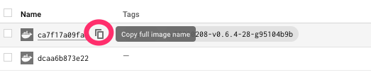

# Release process

## Manual

1. Make sure your repo is clean by git's standards
2. Set environment variable `GITHUB_TOKEN` to a GitHub personal access token
3. If this is a new minor release, create a new release branch and push to GitHub, otherwise switch to it, for example `release-0.6`
4. Tag the repository and push the tag `git tag -s -m $VERSION $VERSION`. `-s` flag is for GNU Privacy Guard (GPG) signing
5. Push the commit of the tag to the release branch: `git push origin HEAD:release-0.6`
6. Set environment variables `PREVIOUS_VERSION` which is the last release tag and `VERSION` which is the current release version.
7. Checkout the tag you've just created and make sure git is in a clean state
8. Export the current branch `BRANCH=release-0.6` and run `make release`
9. A prow job will start running to push images to the staging repo, can be seen [here](https://testgrid.k8s.io/sig-cluster-lifecycle-image-pushes#post-cluster-api-provider-aws-push-images).
10. Run `make create-gh-release` to create a draft release on Github, copying the generated release notes from `out/CHANGELOG.md` into the draft.
11. Run `make upload-gh-artifacts` to upload artifacts from .out/ directory, however you may run into API limit errors, so verify artifacts at next step
12. Verify that all the files below are attached to the drafted release:
    1. `clusterawsadm-darwin-amd64`
    2. `clusterawsadm-linux-amd64`
    3. `infrastructure-components.yaml`
    4. `cluster-template.yaml`
    5. `cluster-template-machinepool.yaml`
    6. `cluster-template-eks.yaml`
    7. `cluster-template-eks-managedmachinepool.yaml`
    8. `cluster-template-eks-managedmachinepool-vpccni.yaml`
    9. `cluster-template-eks-managedmachinepool-gpu.yaml`
    10. `eks-controlplane-components.yaml`
    11. `eks-bootstrap-components.yaml`
    12. `metadata.yaml`
13. Perform the [image promotion process](https://github.com/kubernetes/k8s.io/tree/master/k8s.gcr.io#image-promoter):
    1. Clone and pull down the latest from [kubernetes/k8s.io](https://github.com/kubernetes/k8s.io)
    2. Create a new branch in your fork of `kubernetes/k8s.io`.
    3. The staging repository is [here](https://console.cloud.google.com/gcr/images/k8s-staging-cluster-api-aws/GLOBAL). 
    4. Ensure you choose the top level [cluster-api-aws-controller](https://console.cloud.google.com/gcr/images/k8s-staging-cluster-api-aws/GLOBAL/cluster-api-aws-controller?gcrImageListsize=30), which will provide the multi-arch manifest, rather than one for a specific architecture.
    5. Wait for an image to appear with the tagged release version:
    
    6. Click on the `Copy full image name` icon
    7. In your `kubernetes/k8s.io` branch edit `k8s.gcr.io/images/k8s-staging-cluster-api-aws/images.yaml` and add an try for the version using the pasted value from earlier. For example: `"sha256:06ce7b97f9fe116df65c293deef63981dec3e33dec9984b8a6dd0f7dba21bb32": ["v0.6.4"]`
    8. Repeat for [eks-bootstrap-controller](https://console.cloud.google.com/gcr/images/k8s-staging-cluster-api-aws/GLOBAL/eks-bootstrap-controller?gcrImageListsize=30) and [eks-controlplane-controller](https://console.cloud.google.com/gcr/images/k8s-staging-cluster-api-aws/GLOBAL/eks-controlplane-controller?gcrImageListsize=30)
    9. You can use [this PR](https://github.com/kubernetes/k8s.io/pull/1565) as example
    10. Wait for the PR to be approved and merged
14. Finalise the release notes. Add image locations `<ADD_IMAGE_HERE>` (e.g., us.gcr.io/k8s-artifacts-prod/cluster-api-aws/cluster-api-aws-controller:v0.6.4) and replace `<RELEASE_VERSION>` and `<PREVIOUS_VERSION>`.
15. Make sure image promotion is complete before publishing the release draft. The promotion job logs can be found [here](https://testgrid.k8s.io/wg-k8s-infra-k8sio#post-k8sio-image-promo) and you can also try and pull the images (i.e. ``docker pull us.gcr.io/k8s-artifacts-prod/cluster-api-aws/cluster-api-aws-controller:v0.6.4`) 
16. Publish release. Use the pre-release option for release
     candidate versions of Cluster API Provider AWS.
17. Email `kubernetes-sig-cluster-lifecycle@googlegroups.com` to announce the release
