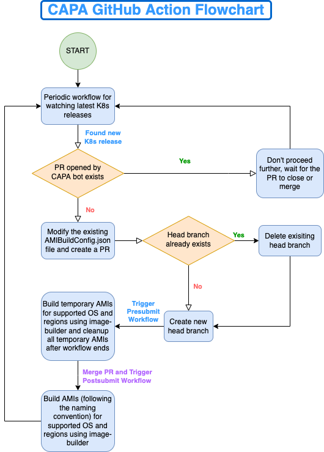

# CAPA GitHub Action for Building/Publishing AMIs

## Table of Contents

- [CAPA GitHub Action for Building/Publishing AMIs](#capa-github-action-for-buildingpublishing-amis)
  - [Table of Contents](#table-of-contents)
  - [Summary](#summary)
  - [Motivation](#motivation)
  - [Proposal](#proposal)
    - [Flowchart](#flowchart)
    - [Components](#components)
  - [Testing the CAPA GitHub Action](#testing-the-capa-github-action)
  - [Migrating the Presubmit and Postsubmit Workflows to Prow](#migrating-the-presubmit-and-postsubmit-workflows-to-prow)
  - [Roadblocks & Limitations](#roadblocks--limitations)
  - [Scope of Improvement](#scope-of-improvement)

## Summary
The Cluster API Provider AWS (CAPA) project builds and publishes AMIs at every new Kubernetes release for the 3 most recent minor versions of Kubernetes. This proposal is aimed towards making this entire process automated over cloud instead of a user’s system by using GitHub Actions.

Tested repo: https://github.com/zeborg/cluster-api-provider-aws/tree/ami-action

## Motivation
At present, this process of building and publishing the AMIs is carried out manually by one of the core project members on their own computer system. The usual steps to perform this task are:
1. Setup [image-builder](https://github.com/kubernetes-sigs/image-builder/) and its dependencies on their system.
2. Setup AWS CLI and the AWS account’s credentials on which the images are supposed to be published.
3. Configure the `image-builder` packer flags to customize the image specifications (eg. Kubernetes version, CNI version, etc.) using a packer configuration file that stores these custom specifications as variables within a JSON file as key-value pairs.
4. Run `image-builder`, which may take up to 5 hours to build the images for all the supported OS and copy them to all the supported regions.

With the help of this GitHub action, this entire process of building the AMIs can be (almost) fully automated. It’s not fully automated at the moment due to the step where a manual merge is required for the automated pull request, which has been explained in [this section](#testing-the-capa-github-action) of this proposal.

<table>
  <tr>
   <td colspan="5" ><strong>Supported Operating Systems</strong>
   </td>
  </tr>
  <tr>
   <td>amazon-2
   </td>
   <td>ubuntu-20.04
   </td>
   <td>ubuntu-18.04
   </td>
   <td>centos-7
   </td>
   <td>flatcar-stable
   </td>
  </tr>
</table>

<table>
  <tr>
   <td colspan="3" ><strong>Supported Regions</strong>
   </td>
  </tr>
  <tr>
   <td>ap-northeast-1
   </td>
   <td>ap-northeast-2
   </td>
   <td>ap-south-1
   </td>
  </tr>
  <tr>
   <td>ap-southeast-1
   </td>
   <td>ap-southeast-2
   </td>
   <td>ca-central-1
   </td>
  </tr>
  <tr>
   <td>eu-west-1
   </td>
   <td>eu-west-2
   </td>
   <td>eu-west-3
   </td>
  </tr>
  <tr>
   <td>eu-central-1
   </td>
   <td>us-east-1
   </td>
   <td>us-east-2
   </td>
  </tr>
  <tr>
   <td>us-west-1
   </td>
   <td>us-west-2
   </td>
   <td>sa-east-1
   </td>
  </tr>
</table>

## Proposal

### Flowchart


### Components
```
.
├── .github
│   └── workflows
│       ├── ami_periodic.yaml
│       ├── ami_postsubmit.yaml
│       └── ami_presubmit.yaml
└── hack
    └── tools
        └── ami
            ├── AMIBuildConfig.json
            ├── AMIBuildConfigDefaults.json
            ├── custom
            │   ├── funcs.go
            │   └── types.go
            ├── github-action
            │   └── main.go
            ├── go.mod
            ├── go.sum
            └── prow
                └── main.go
```

The `.github/workflows` directory contains all the three workflows that are required for our GitHub Actions as YAML configurations. For understanding the GitHub Actions workflow syntax, [this documentation](https://docs.github.com/es/actions/using-workflows/workflow-syntax-for-github-actions) provided by GitHub will be helpful.

The `hack/tools/ami` directory contains the Go source code as well as the JSON configuration files for our custom GitHub Action. Upon implementing this action in another repository, the `hack/tools/ami` directory needs to be strictly put in the root folder of the repository.

A brief description of every file within this project is given below:

* `.github/workflows`
  * `ami_periodic.yaml` (Periodic/Scheduled Workflow)
    \
    This workflow is triggered at a specific interval defined using the cron syntax. It’s responsible for fetching the latest Kubernetes release version from https://dl.k8s.io/release/stable.txt, and it compares the latest patch versions of this release’s minor version as well as the previous 2 releases’ minor versions with the versions stored in the file `hack/tools/ami/AMIBuildConfig.json`. Upon comparison, if any of the versions are found to be outdated in the current `AMIBuildConfig.json`, a pull request is created against the repository’s main branch to update the older release versions to the latest ones.
    In `hack/tools/ami/AMIBuildConfig.json`, the minor versions are stored as key-value pairs with keys `min1` (stable release of the latest minor version), `min2` (stable release of the previous minor version) and `min3` (stable release of the minor version prior to the previous minor version).

    For example, at the time of writing this document, this link displays `v1.24.1` as its content. So the periodic workflow would compare the latest patch versions of minor versions `v1.24`, `v1.23` and `v1.22` with the latest patch versions stored in `hack/tools/ami/AMIBuildConfig.json`. At the moment, the latest releases for minor versions `v1.23` and `v1.22` are `v1.23.7` and `v1.22.10` respectively. Therefore, the content of `AMIBuildConfig.json` in the pull request created upon detecting a new Kubernetes release would be:

    ```json
    {
      "k8s_releases": {
        "min1": "v1.24.1",
        "min2": "v1.23.7",
        "min3": "v1.22.10"
      }
    }
    ```

    The purpose of `AMIBuildConfig.json` is to store the Kubernetes release versions for which we need to build the AMIs, and once a pull request is created with updated Kubernetes release version(s) in this file for any of the keys, the Presubmit workflow is triggered which is responsible for building temporary CAPA AMIs for the purpose of testing.
    \
    The environment variables that can be set for this workflow along with their defaults are:
    * **GITHUB_TOKEN**
      \
      Used for providing required permissions to the workflow environment.
      \
      Default value: `${{ steps.generate-token.outputs.token }}`
    * **CAPA_ACTION_BASE_BRANCH**
      \
      The base branch for the pull request created by the periodic workflow.
      \
      Default value: `"main"`
    * **CAPA_ACTION_HEAD_BRANCH**
      \
      The head branch for the pull request created by the periodic workflow.
      \
      Default value: `"capa-ami-action"`
    * **AMI_BUILD_CONFIG_FILENAME**
      \
      Name of the file that stores latest Kubernetes release versions for building AMIs (located in directory `hack/tools/ami` within the repository).
      \
      Default value: `"AMIBuildConfig.json"`
    * **CAPA_ACTION_PR_REVIEWERS**
      \
      Reviewers to be requested on the pull request created by the periodic workflow.
      \
      Default value: `"zeborg,zebhinav"`
    * **CAPA_ACTION_PR_ASSIGNEES**
      \
      Users to be assigned to the pull request created by the periodic workflow.
      \
      Default value: `"zeborg,zebhinav"`


  * `ami_presubmit.yaml` (Presubmit Workflow)
    \
    This workflow is triggered whenever a pull request is created to update `hack/tools/ami/AMIBuildConfig.json`. It fetches the Kubernetes release versions from `min1`, `min2` and `min3` in the file and checks whether AMIs for these Kubernetes versions already exist in the AWS account. If an AMI for one of these Kubernetes versions already exists, the `image-builder` process is skipped for that version, otherwise the image-builder builds the AMIs for the operating systems defined in `AMI_BUILD_SUPPORTED_OS` environment variable and replicates them to all the regions mentioned in the `AMI_BUILD_REGIONS` environment variable.
    \
    The environment variables that can be set for this workflow along with their defaults are:
    * **AMI_BUILD_CONFIG_FILENAME**
      \
      Name of the file that stores latest Kubernetes release versions for building AMIs (located in directory `hack/tools/ami` within the repository).
      Default value: `"AMIBuildConfig.json"`
    * **AMI_BUILD_CONFIG_DEFAULTS**
      \
      Name of the file that stores default values for the packer variables used by image-builder (located in directory `hack/tools/ami` within the repository). The global packer variable defaults can be provided in the default field, and the OS-specific packer variable defaults can be provided in the OS fields (i.e. amazon-2, centos-7, flatcar, ubuntu-1804 and ubuntu-2004).
      \
      Default value: `"AMIBuildConfigDefaults.json"`
    * **AMI_BUILD_SUPPORTED_OS**
      \
      Operating systems to build the AMIs for.
      \
      Default value: `"amazon-2"`
    * **AMI_BUILD_REGIONS**
      \
      Regions on which the AMIs will be published.
      \
      Default value: `"us-east-1"`
    * **AWS_ACCESS_KEY_ID**
      \
      AWS Access Key ID for the account to be used for publishing AMIs.
      \
      Default value: `${{ secrets.AWS_ACCESS_KEY_ID }}`
    * **AWS_SECRET_ACCESS_KEY**
      \
      AWS Secret Access Key for the account to be used for publishing AMIs.
      \
      Default value: `${{ secrets.AWS_SECRET_ACCESS_KEY }}`
    * **AWS_AMI_OWNER_ID**
      \
      Owner ID (numeric) of the account on which the AMIs will be published.
      \
      Default value: None

  * `ami_postsubmit.yaml` (Postsubmit Workflow)
    \
    This workflow is triggered upon merging the pull request created by the Periodic/Scheduled workflow. It is exactly the same as the Presubmit workflow, except that the AMI names generated in this workflow do not contain the `test-` prefix. The environment variables are also the same in this workflow as those in the Presubmit workflow, but the default values for variables `AMI_BUILD_REGIONS` and `AMI_BUILD_SUPPORTED_OS` vary in both as since the Presubmit workflow is only executed for the purpose of testing, it need not build AMIs for all the supported OS and regions as opposed to the Postsubmit workflow.
    \
    The environment variables that can be set for this workflow along with their defaults are:
    * **AMI_BUILD_CONFIG_FILENAME**
      \
      Name of the file that stores latest Kubernetes release versions for building AMIs (located in directory `hack/tools/ami` within the repository).
      \
      Default value: `"AMIBuildConfig.json"`
    * **AMI_BUILD_CONFIG_DEFAULTS**
      \
      Name of the file that stores default values for the packer variables used by image-builder (located in directory `hack/tools/ami` within the repository). The global packer variable defaults can be provided in the default field, and the OS-specific packer variable defaults can be provided in the OS fields (i.e. amazon-2, centos-7, flatcar, ubuntu-1804 and ubuntu-2004).
      \
      Default value: `"AMIBuildConfigDefaults.json"`
    * **AMI_BUILD_SUPPORTED_OS**
      \
      Operating systems to build the AMIs for.
      \
      Default value: `"amazon-2,centos-7,flatcar,ubuntu-1804,ubuntu-2004"`
    * **AMI_BUILD_REGIONS**
      \
      Regions on which the AMIs will be published.
      \
      Default value: `"ap-south-1,eu-west-3,eu-west-2,eu-west-1,ap-northeast-2,ap-northeast-1,sa-east-1,ca-central-1,ap-southeast-1,ap-southeast-2,eu-central-1,us-east-1,us-east-2,us-west-1,us-west-2"`
    * **AWS_ACCESS_KEY_ID**
      \
      AWS Access Key ID for the account to be used for publishing AMIs.
      \
      Default value: `${{ secrets.AWS_ACCESS_KEY_ID }}`
    * **AWS_SECRET_ACCESS_KEY**
      \
      AWS Secret Access Key for the account to be used for publishing AMIs.
      \
      Default value: `${{ secrets.AWS_SECRET_ACCESS_KEY }}`
    * **AWS_AMI_OWNER_ID**
      \
      Owner ID (numeric) of the account on which the AMIs will be published. If set as empty or not defined, the default value is internally configured to be `258751437250` (VMware).
      \
      Default value: None
* `hack/tools/ami`
  * `custom/funcs.go`
    \
    Contains the custom function definitions that are used throughout the project.
  * `custom/types.go`
    \
    Contains the custom type definitions that are used throughout the project.
  * `github-action/main.go`
    \
    Contains all the code used within the `ami_periodic.yaml` workflow. More specifically, it is responsible for automatically creating a pull request whenever a new release of Kubernetes is spotted. If the head branch configured in the environment variables already exists, then it will delete the existing one and recreate it from the latest main branch in the absence of a pull request from the same head branch. If a pull request from the same head branch exists as well, then the workflow will exit and the maintainers will need to either close or merge the existing pull request.
  * `prow/main.go`
    \
    Contains all the code used within the `ami_presubmit.yaml` and `ami_postsubmit.yaml` workflows. More specifically, it is responsible for building the CAPA AMIs using image-builder when any of these two workflows is executed. When the `-cleanup` boolean flag is set to `true`, it cleans up all the temporary AMIs and their corresponding snapshots in the AWS account.
  * `AMIBuildConfig.json`
    \
    Contains the `min1`, `min2` and `min3` version definitions (as discussed earlier).
  * `AMIBuildConfigDefaults.json`
    \
    Stores default global as well as OS-specific values for the packer variables used by `image-builder` (as discussed earlier).

## Testing the CAPA GitHub Action
Setting up a custom GitHub Application with appropriate permissions is a prerequisite for this action. The steps for that can be found [here](https://github.com/peter-evans/create-pull-request/blob/main/docs/concepts-guidelines.md#authenticating-with-github-app-generated-tokens) (from step 1 to 4 under Authenticating with GitHub App generated tokens). Once the GitHub Application has been configured and added to the repository along with its secrets, you can proceed with the testing.

In order to test the action on your own repository without having to wait for the periodic delay, ensure that the `ami_periodic.yaml` workflow is triggered on push event as shown below:
\

\
To test if the Periodic workflow is working as expected, just make some modifications in the Kubernetes versions mentioned in `hack/tools/ami/AMIBuildConfig.json` file such as lowering the version of any or all release versions mentioned in min1, min2 and min3 fields.

Once the periodic workflow is triggered, it will look for any existing PR against `CAPA_ACTION_BASE_BRANCH` with the head as `CAPA_ACTION_HEAD_BRANCH` within the repository. If any such PR exists, the action will not proceed any further and would wait for the existing PR to either get merged or closed.
If no such PR exists, it will then check for the existence of `CAPA_ACTION_HEAD_BRANCH` within the repository. If it exists, it will be deleted and then recreated from the latest `CAPA_ACTION_BASE_BRANCH`.

Once these checks are performed, the action will then proceed with creating the pull request. The key logic behind creating the pull request originates from [this article](http://www.levibotelho.com/development/commit-a-file-with-the-github-api/). It mentions all the core steps behind creating a commit on GitHub and then updating a reference/branch to point to that commit. This branch is considered as our HEAD branch for the pull request (as defined in `CAPA_ACTION_HEAD_BRANCH` environment variable).

Once the pull request is created, it will trigger the Presubmit workflow which will begin with the process of building temporary CAPA AMIs with `test-` prefix using `image-builder`. Upon successful completion of the Presubmit workflow we can proceed with merging the pull request, which will then trigger the Postsubmit workflow, which is responsible for building and publishing the final CAPA AMIs. It is also due to the manual merging of the pull request we cannot call this entire process “fully automated”, but it has been kept so in order to provide some level of human control over the workflow during any unexpected or undiscovered edge cases or packer flag customization before proceeding with the final publishing of AMIs.

## Migrating the Presubmit and Postsubmit Workflows to Prow
The Presubmit and Postsubmit workflows can be easily migrated to Prow by converting the following steps mentioned within the current workflow definitions to shell scripts:
* **Presubmit**
  ```bash
  cd hack/tools/ami
  git clone https://github.com/kubernetes-sigs/image-builder.git
  cd image-builder/images/capi
  sed -i 's/capa-ami-/test-capa-ami-/' ./packer/ami/packer.json
  make deps-ami
  cd ../../..
  go run prow/main.go -cleanup
  ```
* **Postsubmit**
  ```bash
  cd hack/tools/ami
  git clone https://github.com/kubernetes-sigs/image-builder.git
  cd image-builder/images/capi
  make deps-ami
  cd ../../..
  go run prow/main.go
  ```

To ensure that the above scripts work as expected, the Prow environment should at least be configured with the required environment variables and secrets as mentioned in the workflow YAML definitions, Go 1.17 and AWS CLI.

## Roadblocks & Limitations
* At present, we are not able to elevate the permissions for `GITHUB_TOKEN` in CAPA’s GitHub repository possibly due to some restrictions enforced by the `kubernetes-sigs org`. This causes an error while executing the Periodic GitHub Workflow since it requires the usage of `GITHUB_TOKEN` with elevated permissions that allow the creation of a pull request by the Periodic GitHub Workflow within the repository.
* GitHub Actions do not trigger workflows that are triggered upon creation of pull requests if the pull request is created by `github-actions[bot]`, i.e., if we use `GITHUB_TOKEN` as the secret for creating pull requests within the periodic workflow (`ami_periodic.yaml`) [(more info here)](https://github.com/peter-evans/create-pull-request/blob/main/docs/concepts-guidelines.md#triggering-further-workflow-runs). For this reason, the most reasonable approach I could think of was to create a GitHub application with appropriate permissions and use its App ID and private key to generate a token that could be used by our CAPA periodic workflow to access the GitHub API endpoints that we need to deal with within the workflow itself using the [tibdex/github-app-token](https://github.com/marketplace/actions/github-app-token) action.

## Scope of Improvement
* We’re using the [tibdex/github-app-token](https://github.com/marketplace/actions/github-app-token) action to generate tokens for our GitHub Application bot, which we can instead develop and customize by ourselves to gain control over the entire source code of our GitHub Action instead of relying on third-party actions.
