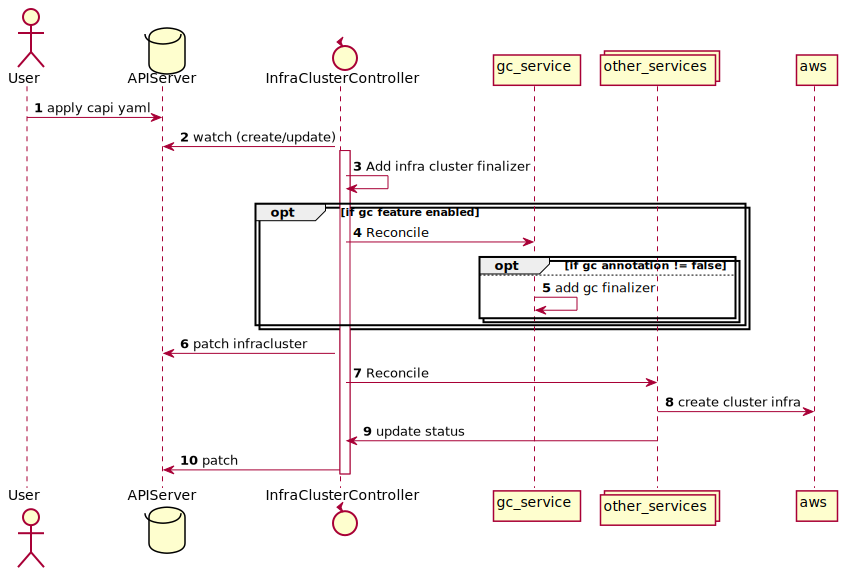
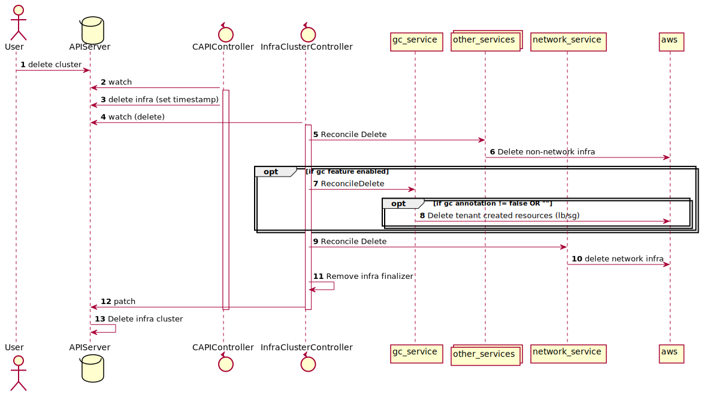

# External Resource Garbage Collection

## Table of Contents

- [External Resource Garbage Collection](#external-resource-garbage-collection)
  - [Table of Contents](#table-of-contents)
  - [Glossary](#glossary)
  - [Summary](#summary)
  - [Motivation](#motivation)
    - [Goals](#goals)
    - [Non-Goals/Future Work](#non-goalsfuture-work)
  - [Proposal](#proposal)
    - [User Stories](#user-stories)
      - [Story 1](#story-1)
      - [Story 2](#story-2)
      - [Story 3](#story-3)
      - [Story 4](#story-4)
  - [Requirements](#requirements)
    - [Functional](#functional)
    - [Non-Functional](#non-functional)
    - [Implementation Details/Notes/Constraints](#implementation-detailsnotesconstraints)
      - [Proposed Changes](#proposed-changes)
        - [Cluster Creation](#cluster-creation)
          - [API Changes](#api-changes)
          - [Controller Changes](#controller-changes)
          - [New Garbage Collection Service](#new-garbage-collection-service)
        - [Cluster Deletion](#cluster-deletion)
          - [Controller Changes](#controller-changes-1)
          - [New Garbage Collection Service](#new-garbage-collection-service-1)
        - [clusterawsadm changes](#clusterawsadm-changes)
    - [Alternative Approaches Considered](#alternative-approaches-considered)
      - [Using CCM to do the delete](#using-ccm-to-do-the-delete)
    - [Risks and Mitigations](#risks-and-mitigations)
      - [Replicating CCM](#replicating-ccm)
      - [Similar functionality in upstream CAPI](#similar-functionality-in-upstream-capi)
  - [Upgrade Strategy](#upgrade-strategy)
  - [Additional Details](#additional-details)
    - [Test Plan](#test-plan)
    - [Graduation Criteria](#graduation-criteria)
      - [Alpha](#alpha)
      - [Beta](#beta)
      - [Stable](#stable)
  - [Implementation History](#implementation-history)

## Glossary

- CAPA - An abbreviation of Cluster API Provider AWS.
- ELB - Elastic Load Balancer
- NLB - Network Load Balancer
- CCM - Cloud Controller Manager

## Summary

If you create a child cluster using CAPA which then in turn creates a `Service` of type `LoadBalancer` this results in a load balancer being created in AWS for that service. The type of load balancer created by default is a **Classic ELB** but you can also create a NLB by annotating your service. For example:

```yaml
apiVersion: v1
kind: Service
metadata:
  name: podinfo-nlb
  annotations:
    service.beta.kubernetes.io/aws-load-balancer-type: "nlb"
```

If you try to delete the child/tenant cluster using CAPI/CAPA then it will fail to delete the clusters infrastructure fully in AWS as the VPC is still being using by the NLB that was created. For example:

```text
E0609 15:49:16.022022  ###### API Changes) b │
│ efore detaching the gateway.\n\tstatus code: 400, request id: 65dc0fa0-584f-4256-baf5-a2aac2d2dde4" "reconciler group"="controlplane.cluster.x-k8s.io" "reconciler kind"="AWSManaged │
│ ControlPlane" "name"="capi-managed-test-control-plane" "namespace"="default" 
```

Currently CAPA will attempt to delete all the resources it has directly created as part of the cluster lifecycle management. However, if the CCM in the child/tenant cluster has created any resources then these will not be attempted to be deleted.

This proposal outlines a new feature that will be added to CAPA that will delete externally created resources, such as load balancers & security groups, of the child/tenant cluster. This will be referred to as **garbage collection".

The new feature is expected to be compatible with unmanaged (i.e. EC2 control plane) and EKS CAPA created clusters.

## Motivation

Adopters of CAPA expect that a request to delete a cluster should succeed and preferably that there be no external AWS resources for that cluster orphaned.

The traditional thinking is that a user should delete all the workloads on the cluster before deleteing the actual cluster. But the reality is that some clusters are short lived (testing & dev clusters are a good example) and this are normally delete via `kubectl delete Cluster mytest` without clearing the workloads from the cluster.

This proposal aims to make this a better experience for the user of CAPA.

### Goals

1. To delete AWS resources that where created by CCM in the child/tenant cluster.
2. To work across unmanaged (i.e. EC2 control plane) and managed (i.e. EKS) clusters.
3. Solution must work in a scenario where GitOps is used.

### Non-Goals/Future Work

- Delete EBS volumes created by the CCM
  - This will be considered as part of future work
- Clean-up other resources created by something other than the CCM (for example a custom operator)
- Fine grained control of which clusters will be garbage collected or not
  - Initially if the feature is enabled it will be an opt-out model
  - We will add finer grained control in a future enhancement

## Proposal

### User Stories

#### Story 1

As an platform operator/engineer
I want to delete a cluster and all its associated AWS resources
When not using GitOps
So that there are no orphaned/unused AWS resources

#### Story 2

As a platform operator/engineer
I want to be able to delete a cluster and all its associated AWS resources 
When using a GitOps tools (like Flux/Argo)
So that there are no orphaned/unused AWS resources

#### Story 3

As a platform operator/engineer
I want to be able to opt-out a cluster of being garbage collected

#### Story 4

As a platform operator/engineer
I want to be able to opt-in/opt-out a cluster for garbage collection
After it has been created
So that i can investigate/overcome issues

## Requirements

### Functional

<a name="FR1">FR1.</a> CAPA MUST support cleaning up of AWS resources created by the CCM for a tenant cluster when not using GitOps.

<a name="FR2">FR2.</a> CAPA MUST support cleaning up of AWS resources created by the CCM for a tenant cluster when using GitOps.

<a name="FR3">FR3.</a> CAPA MUST support cleaning up of AWS resources for unmanaged and managed clusters

<a name="FR4">FR4.</a> CAPA MUST support a way to opt-out of garbage collection at the point of cluster creation.

<a name="FR5">FR5.</a> CAPI MUST not allow me to delete a cluster fullt until garbage collection has occurred.

<a name="FR6">FR6.</a> CAPA SHOULD provide a way for me to opt-in or opt-out a cluster from garbage collection AFTER it has been created.

### Non-Functional

<a name="NFR8">NFR8.</a> CAPA MUST be able to easily add additional AWS resource cleanup in the future.

<a name="NFR9">NFR9.</a> Unit tests MUST exist for new garbage collection code.

<a name="NFR10">NFR10.</a> e2e tests MUST exist for the new garbage collection code for both unmanaged and managed clusters..

### Implementation Details/Notes/Constraints

#### Proposed Changes

In the initial implementation of garbage collection if the feature is enabled all clusters will by default be marked for garbage collection. But we will supply a means to opt-out at time of creation as per [FR4](#FR4).

The proposed changes will be documented depending on if the cluster is being created/updated or deleted.

> NOTE: garbage collection will be experimental initial and will be enabled via a feature flag.

##### Cluster Creation

The following sequence diagram depicts what will happen when you create a new cluster with CAPI/CAPA with this change. The numbers will be referenced in the following descriptions.



###### API Changes

If the garbage collection feature has been enabled via the feature flag then the point that a user can mark a cluster as opting out of garbage collection ([FR4](#FR4)) is when they apply the yaml (1). This will be accomplished by annotating the **AWSCluster** or **AWSManagedControlPlane** with the `aws.cluster.x-k8s.io/external-resource-gc` annotation and setting its value to **false**.

If the `aws.cluster.x-k8s.io/external-resource-gc` annotation is absent or its value is set to **true** then the CAPA created cluster will be garbage collected.

This annotation name will be in a publicly exported package.

###### Controller Changes

The controllers for `AWSCluster` and `AWSManagedControlPlane` will be modified so that on creation of the controllers you can indicate that the garbage collection feature flag is enabled. In [main.go](../../main.go) we will look to see if the feature flag is enabled and pass this in when creating the instances of the 2 controllers.

In the **reconcileNormal** of both controllers we will add logic at the beginning of reconciliation related to garbage collection. It will be after adding the existing finalizer (3) but before any AWS resources have been created (7,8). The logic will only be called if the garbage collection feature flag is enabled.

The logic will be encapsulated in a new service and will have an **Reconcile** method which will be called from the controller (4).

After the gc service **Reconcile** has been called the normal provisioning of the cluster will occur (7,8,9,10).

###### New Garbage Collection Service

The logic of the actions to take when a cluster is created or deleted will be contained in a new garbage collection (gc_service) service.

For cluster creation there will be a **Reconcile** function. The purpose of this function is to determine if the cluster should be garbage collected and mark the infra cluster object accordingly.

As mentioned previously a cluster will be garbage collected if either of these are true:

- the `aws.cluster.x-k8s.io/external-resource-gc` annotation is absent
- the `aws.cluster.x-k8s.io/external-resource-gc` and its value is set to **true**

If the infra cluster is to be garbage collected (i.e. it satisfies one of these rules) then a new finalizer will be added (5) to the infra cluster called `awsexternalresourcegc.infrastructure.cluster.x-k8s.io`.

This new finalizer will be persisted via the existing patching of the infra cluster (6).

> NOTE: you will be able to check if a cluster is marked for garbage collection by looking at the finalizers on `AWSCluster` or `AWSManagedControlPlane`.

##### Cluster Deletion

The following sequence diagram depicts what will happen when you delete a new cluster with CAPI/CAPA with this change. The numbers will be referenced in the following descriptions.



###### Controller Changes

The **reconcileDelete** of controllers for `AWSCluster` and `AWSManagedControlPlane` will be modified so that garbage collection will occur if the corresponding infra cluster object has the `awsexternalresourcegc.infrastructure.cluster.x-k8s.io` finalizer.

The point at which we do the garbage collection is important. If we do it too soon we run the risk of the resources being re-created in AWS. The **reconcileDelete** will have 3 distinct phases:

- Delete CAPA owned AWS resources for cluster that are not related to the **NetworkSpec**. This will be done via the existing services in CAPA (5, 6).
- If the infra cluster has the gc finalizer then **ReconcileDelete** will be called (7) on the new garbage collection service. Its the role of the garbage collection service to identify the CCM created AWS resources for the cluster and delete them (8).
- Delete CAPA owned AWS resources for that cluster that are related to the **NetworkSpec**. This will be done via the existing network service (11,12).

###### New Garbage Collection Service

For cluster deletion there will be a **ReconcileDelete** function. The purpose of this function is to identify the AWS resources that have been created for the cluster via the CCM. And then for the identified resources delete them in AWS.

To identify the resources that the CCM has created for the cluster we will use the **AWS resource tagging api** to query for all  resources that have a label called `kubernetes.io/cluster/[CLUSTERNAME]` with a value of `owned`. Note `[CLUSTERNAME]` will be replaced with the Kubernetes cluster name.

Based on the list of resources returned we will group these by the owing AWS service (i.e. **ec2**, **elasticloadbalancing**). The grouped resources will then be passed to a function for that service which will take care of cleaning up the resources in AWS via API calls (8).

The reason we are grouping by AWS service is that order can matter when deleting. For example, with the **elasticloadbalancing** service you need to delete the load balancers before any target groups.

We will need to create the gc service so that its easy to add new cleanup functions for services in the future [NFR8](#NFR8).

Once all the resources have been cleaned up we can remove the `awsexternalresourcegc.infrastructure.cluster.x-k8s.io` finalizer (9) to indicate that the cluster has been garbage collected.

> NOTE: we will initally not handle clean-up of EBS volumes due to the potential risk of accidental data deletion. This will be considered for a future enhancement.

##### clusterawsadm changes

We would like to supply a way for the user to manually mark a cluster as requiring garbage collection and vice versa opting out of garbage collection [FR6](#FR6).

We will add 2 new commands to `clusterawsadm` to perform this:

- **clusterawsadm gc enable** - this will add the new finalizer and annotation to the infra cluster object. 
- **clusterawsadm gc disable** - this will remove the new finalizer and add/set the `aws.cluster.x-k8s.io/external-resource-gc` annotation to `false`.

### Alternative Approaches Considered

#### Using CCM to do the delete

The initial implementation of the garbage collector relied on the CCM in the child/tenant cluster doing the delete. When a cluster is deleted CAPA would pause the delete reconciliation until garbage collection had been done.

The garbage collector (a separate controller) would:

- Connect to the tenant cluster and get a list of `Services` of type `LoadBalancer`.
- Delete each of the `Services` of type `LoadBalancer`. The CCM in the child/tenant cluster at this point will delete the resources it created in AWS.
- Requeue until all the services as deleted.
- Once all the services are delete mark the cluster has having been garbage collected.

After the cluster has been marked as garbage collected the normal delete reconciliation has be unpaused and start.

**Benefits**

- We don't have to write out own deletion code as we rely on the CCM.

**Downsides**

- With GitOps this is problematic. The garbage collector may delete a service but the tha GitOps operator could reapply the Service and the resources will get re-created. This would potentially surface as a weird timing bug.
- We need to add code to all controllers to pause delete until gc has been done

### Risks and Mitigations

#### Replicating CCM

As we are not relying on the CCM to do the deletion in means that we run the risk of replicating large parts of the CCM. To mitigate this we will only focus of cleaning up resources that can potentially block the CAPA deletion process.

#### Similar functionality in upstream CAPI

There is the possibility that similar and more generalised functionality will be added to upstream CAPI. If this happens and it meets our needs then we will refactor this code to work with the new mechanism and if required deprecate this feature. To mitigate the impact we should keep this feature as experimental for longer that we would normally as this gives is the ability to deprecate it quickly.

## Upgrade Strategy

There are no API changes. However, we have introduced a new feature that will need to be enabled. For existing management clusters you will have to enable the `ExternalResourceGC` feature. This can be done when via editing the `Deployment` for CAPA or at the time of `clusterctl init`.

If you enabled the feature for an existing CAPI management cluster the existing clusters will not be marked as requiring garbage collection. If you wanted to enabled garbage collection for those existing clusters then you can use the the new `clusterawadm gc enable` command.

## Additional Details

### Test Plan

- Unit tests to validate the functionality of the new garbage collection service
- Unit tests to validate the functionality of the new **clusterawsadm** commands.
- e2e tests to test clean-up for un-managed and managed clusters

### Graduation Criteria

#### Alpha

- Initial version as defined by this proposal

#### Beta

- At least 1 year in alpha
- More control over which clusters will be garbage collected (i.e. via label selectors)
- Ability to enable/disable which resources will be clean-up (i.e. optionally include EBS volumes)
- Full e2e coverage.

#### Stable

- At least 6 months in beta
- No alternative CAPI solution in active development

## Implementation History

- [x] 2022/07/11: Change discussed CAPA office hours
- [x] 2022/07/12: Initial proposal
- [ ] 2022/07/20: Open proposal PR

<!-- Links -->
