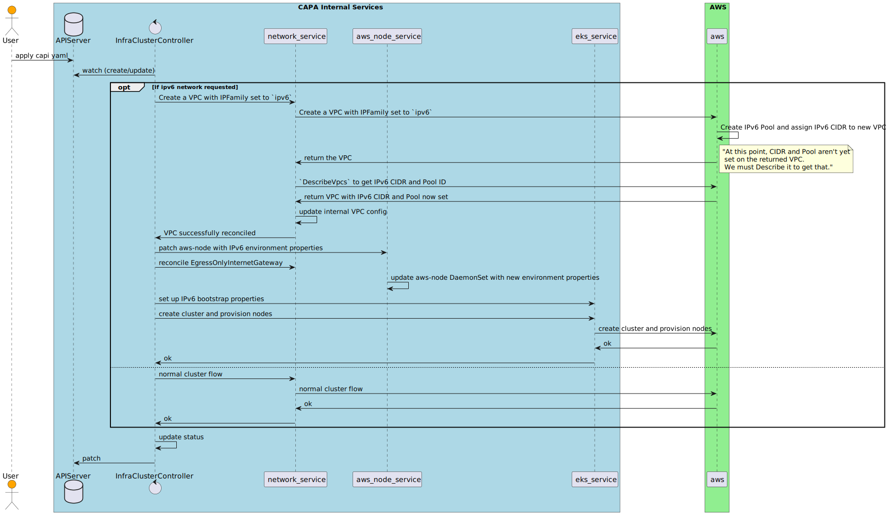
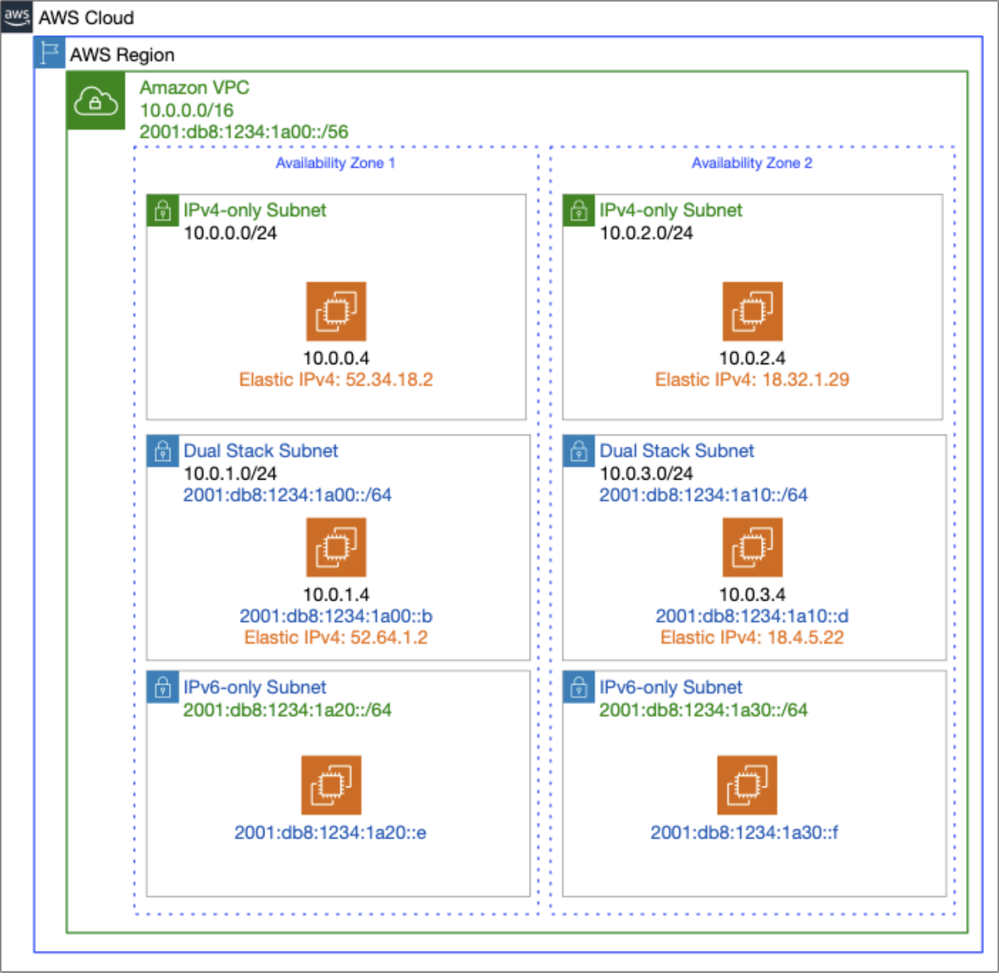

# IPv6 Support in CAPA for EKS

## Table of Contents

- [IPv6 Support in CAPA](#ipv6-support-in-capa-for-eks)
  - [Table of Contents](#table-of-contents)
  - [Glossary](#glossary)
  - [Summary](#summary)
  - [Motivation](#motivation)
    - [End to address exhaustion](#end-to-address-exhaustion)
    - [Ability to use full resources of instances](#ability-to-use-full-resources-of-instances)
  - [Goals](#goals)
  - [Non-Goals/Future Work](#non-goalsfuture-work)
  - [Proposal](#proposal)
    - [Plan](#plan)
      - [Managed and Unmanaged clusters](#managed-and-unmanaged-clusters)
      - [Additions and Configuration changes](#additions-and-configuration-changes)
      - [Networking and Subnet Splitting strategies](#networking-and-subnet-splitting-strategies)
      - [vpc-cni](#vpc-cni)
      - [Node bootstrap script](#node-bootstrap-script)
      - [Egress-Only Internet Gateway](#egress-only-internet-gateway-or-private-networking)
      - [The fate of SecondaryCidrBlock](#the-fate-of-secondarycidrblock)
      - [Validations](#validations)
      - [Addons](#addons)
      - [Routing](#routing)
      - [Security Groups](#security-groups)
    - [Usage Example and Configuration](#usage-example-and-configuration)
    - [Testing](#usage-example-and-configuration)
    - [Pretty Pictures](#usage-example-and-configuration)
  - [User Stories](#usage-example-and-configuration)
  - [Security Model](#usage-example-and-configuration)
  - [Alternatives](#usage-example-and-configuration)
  - [Implementation History](#usage-example-and-configuration)


## Glossary

Refer to the [Cluster API Book Glossary](https://cluster-api.sigs.k8s.io/reference/glossary.html).
- Dual Stack - Doesn't mean Kubernetes dual stack where pods and nodes have both, IPv6 and IPv4 addresses, but that the
defined VPC and CIDR networking in the subnets will have both ip families enabled and assigned. This is to ensure that
communication between old services is still functioning. Only IPv6 is not supported for now.

## Summary

This proposal defines how to implement IPv6 for clusters in CAPA for EKS. It defines various validations that need to
take place in order to properly inform the user when IPv6 can be used. It defines components which need to be created
and set up. It also details with examples and images how the architecture looks like using IPv6 in EKS.

## Motivation

IPv6 is the future for networking. The motivation is clear in moving forward to support users with the option to switch
to it. There are some key benefits which are detailed below:

### End to address exhaustion

There are not enough v4 IPs in the world, and complex workarounds are not cutting it anymore.
IPv4 is a 32-bit address system (eg 192.0.2.146), IPv6 is a 128-bit system (eg: 2001:0db8:85a3:0000:0000:8a2e:0370:7334).
Globally IPv4 allows for approx 4bn IP addresses, which probably seemed like a lot back in the day. RFC 1918 allowed users
to work around public space limitations by using a private subset of address space. This led to a lot of complex architecture
choices. With a VPC CIDR of 192.168.0.0/16, users get 65536 addresses for their cluster. With an EKS assigned IPv6
CIDR (2001:db8:1234:1a00::/56), users get >72 quadrillion.

### Ability to use full resources of instances

Users run out of Elastic Network Interfaces (ENIs) long before they run out of CPU/RAM capacity, so they have to scale
more than is cool. With IPv6, the number of pods which can be run on nodes is no longer restricted by networking
limitations. Now users can run as many pods as their instances CPU and RAM capacities will allow.

## Goals

- Create a cluster with IPv6 networking features for new clusters created with k8s v1.21+ on EKS
- Dual-stack (IPv4+IPv6) VPC, subnets and EC2 instances/nodes
- Allow users to set their own VPC in config
- Allow users to create VPC with own IPv6 CIDR
- User applications running in IPv6 EKS clusters should still be able to access external IPv4 services
- Restrict users to managed addons for 1.21+
- BYOIPv6

## Non-Goals/Future Work

- IPv6-only VPC
- Unmanaged clusters
- Migrate to IPv6 after cluster creation ( means that reconciliation will not update existing cluster to use ipv6 )
- Make IPv6 the default IP family
- Support k8s version that are `< 1.21`
- Option to disable NAT
- Un-managed addons for IPv6 clusters

## Proposal

### Plan

Newly created clusters backed on EKS should be able to support IPv6 based communication throughout the entire cluster
and in addition, to the outside world via exposed services. The pods should have IPv6 addresses but should be able to
contact AWS metadata service using IPv4. A mixed communication is preferred as fully IPv6 clusters are not supported yet
using EKS. Note, AWS does provide an IPv6 metadata service under `fd00:ec2::254` well-known address.

#### Managed and Unmanaged clusters

After careful considering and a lot of debugging and back and forth, we decided that unmanaged clusters will not be
supported at this time. It will come at a later date. The implementation as it stands, allows for unmanaged clusters to
work with ipv6 ( once the validation is removed from `AWSCluster` ) but the circumstances regarding getting the nodes
to work and kubeadm to play nicely are difficult to pinpoint.

Nevertheless, a sample template can be found under . This
represents a possible combination of configuration objects that kubeadm requires.

A validation is added to prevent unmanaged clusters from being able to use IPv6 specific configurations.

#### Additions and Configuration changes

The following additional configuration options will be added:

To the VPC configuration:
```Go
	// IPv6 contains ipv6 specific settings for the network.
	// +optional
	IPv6 *IPv6 `json:"ipv6,omitempty"`
```

Where the IPv6 struct is as follows:

```go
// IPv6 contains ipv6 specific settings for the network.
type IPv6 struct {
	// CidrBlock is the CIDR block provided by Amazon when VPC has enabled IPv6.
	// +optional
	CidrBlock string `json:"cidrBlock,omitempty"`

	// PoolID is the IP pool which must be defined in case of BYO IP is defined.
	// +optional
	PoolID string `json:"poolId,omitempty"`

	// EgressOnlyInternetGatewayID is the id of the egress only internet gateway associated with an IPv6 enabled VPC.
	// +optional
	EgressOnlyInternetGatewayID *string `json:"egressOnlyInternetGatewayId,omitempty"`
}
```

This results in the following yaml settings to the end-user:

```yaml
  network:
    vpc:
      ipv6:
        cidrBlock: 2001:db8:1234:1a03::/64
        poolId: pool-id
        egressOnlyInternetGatewayId: eiwg-1234
```

Or, if no outside cidr block is to be defined, omit the entire inner section to make the cluster IPv6 enabled:

```yaml
  network:
    vpc:
      ipv6: {}
```

The extra struct is added for grouping purposes. The `EgressOnlyInternetGatewayID` should only be set when the user brings
their own VPC too.

To the Subnets:

```go
	// IPv6CidrBlock is the IPv6 CIDR block to be used when the provider creates a managed VPC.
	// A subnet can have an IPv4 and an IPv6 address.
	IPv6CidrBlock string `json:"ipv6CidrBlock,omitempty"`
	// IsIPv6 defines the subnet as an IPv6 subnet. A subnet is IPv6 when it is associated with a VPC that has IPv6 enabled.
	// +optional
	IsIPv6 bool `json:"isIpv6"`
```

These are set in code automatically. No other configurations need to be introduced.

#### Networking and Subnet Splitting strategies

CAPA splits subnets in per azs. This is happening when CAPA is creating the default subnets. In case of AWS, the IPv6
CIDR block is a pre-determined and fixed `/56` prefix value. We can only get this value when we ask AWS to create a new
IPv6 enabled VPC. When that happens, we do a `DescribeVpcs` on the vpc after creation and return the IPv6 CIDR block that
AWS has allocated for us internally.

Once we have that block, we save it in our representation and go on to create the subnets. The subnets have a restriction
that they NEED to have a `/64` prefix. The other restriction is that the subnet-id of the IPv6 address needs to increase
sequentially. This, actually, makes things a lot easier when dealing with splitting because we just always set the prefix
mask to `/64` and do a `++` on the respective subnet bit location. AWS allocated IPv6 addresses hard limit of 256 subnets
that you can create, before you run out of the 8 bit address space.

Subnets also MUST enable `AssignIpv6AddressOnCreation` in ALL cases if IPv6 is enabled. Even in private mode.
See [Egress-Only Internet Gateway or Private networking](#egress-only-internet-gateway-or-private-networking).

#### vpc-cni

Luckily, vpc-cni is already at a supported version as a minimum version. Which means, in terms of version, there is
nothing to do.

However, there have to be modifications in how to set up vpc-cni in case of IPv6. These modifications have been applied
as part of [PR1](https://github.com/kubernetes-sigs/cluster-api-provider-aws/pull/3374) and [PR2](https://github.com/kubernetes-sigs/cluster-api-provider-aws/pull/3568) respectively by adding
the ability to define custom environment variables for the vpc-cni DaemonSet.

Using this ability, the user has to define the following environment properties:

```yaml
spec:
  vpcCni:
    env:
      - name: ENABLE_PREFIX_DELEGATION
        value: "true"
      - name: ENABLE_IPv6
        value: "true"
      - name: ENABLE_IPv4
        value: "false"
```

An alternative consideration is to set these up automatically if IPv6 is enabled. But that has the unknown side effect
that the user is unaware that additional environment properties have been set up for the vpc-cni and potentially could
overwrite them. The code could account for that scenario, of course, but requiring it explicitly seems like a good idea.

#### Node bootstrap script

User data needs a slight adjustment, but Richard has done the work already on that. We just need to auto set it in case
it hasn't been already provided by the user in `eksconfig_controller.go`. The two things that the bootstrap script defines
is `IPFamily` and `ServiceIPV6Cidr`.

#### Egress-Only Internet Gateway or Private networking

There is no such thing as private IP with IPv6. Every address is a global address. To prevent access to internal structures
AWS introduced the EgressOnlyInternetGateway. This needs to be created and set as a gateway for all subnets that are
marked as private. More about EgressOnlyInternetGateway [here](https://docs.aws.amazon.com/vpc/latest/userguide/egress-only-internet-gateway.html).
In short, the name describes what it does. It prevents internet access from the outside, but allows calls from the subnet
to the outside.

#### The fate of SecondaryCidrBlock

SecondaryCidrBlock was added in order for the user to have the ability to have more ip space. This is not required with
IPv6. Thus, this field can be safely ignored. The user can still set it for IPv4 addresses though. So we don't disable
it or validate that it has to be empty.

#### Validations

The following validations need to be applied:

- Can't update an existing cluster to IPv6
    - `ValidateUpdate` -> This is the place to check this one
- ipv6Pool needs to be provided if ipv6CidrBlock is provided for a VPC
- Addons need to be defined if IPv6 is enabled
- We could possibly check if the machine is nitro enabled hypervisor
- Cluster version must be 1.21 or higher
- Addon version of CNI must be 1.10 or higher in case of IPv6
- Possibly validate ( if we don't set it automatically ) that the right environment properties are set for vpc-cni
- Prevent unmanaged clusters from using IPv6 settings

#### Instance Type

A specific instance type needs to be used. Only `nitro` instances can be used for IPv6 because they have the required
network interfaces that support IPv6.

#### Addons

Managed addons need to be defined in order for IPv6 to work. This is an AWS requirement.

#### Routing

Public routes will need to include `::/0` in their routes and the EgressOnlyInternetGateway.

#### Security Groups

Security groups will need to be updated to allow traffic to and from `::/0`. This is a bit more finicky than it sounds
because `::/0` is IPv6 format so we'll have to introduce a new field on `IngressRule` which is called `IPv6CidrBlock`
that completes the existing IPv6 `CidrBlock` field and is used to set up the above mentioned range.

### Usage Example and Configuration

A sample configuration could look something like this:

```yaml
...
kind: AWSManagedControlPlane
apiVersion: controlplane.cluster.x-k8s.io/v1beta1
metadata:
  name: "${CLUSTER_NAME}-control-plane"
spec:
  vpcCni:
    env:
      - name: ENABLE_PREFIX_DELEGATION
        value: "true"
      - name: ENABLE_IPv6
        value: "true"
      - name: ENABLE_IPv4
        value: "false"
  network:
    vpc:
      ipv6: {}
  region: "${AWS_REGION}"
  sshKeyName: "${AWS_SSH_KEY_NAME}"
  version: "${KUBERNETES_VERSION}"
  addons:
    - name: "vpc-cni"
      version: "v1.11.0-eksbuild.1"
      conflictResolution: "overwrite"
    - name: "coredns"
      version: "v1.8.7-eksbuild.1"
    - name: "kube-proxy"
      version: "v1.22.6-eksbuild.1"
...
```

### Testing

An e2e test has been added to cover EKS Managed cluster ipv6 creation. Further manual tests are performed to check if
connectivity works such as, but not limited to:
- pod to pod communication
- opening a port via an IPv6 service address to the outside
- multi-node communication; services located on different nodes

### Pretty Pictures





## User Stories

As a CAPA user:
- I can create a cluster using EKS that is in a new IPv6 & IPv4 dual-stack VPC
- I can create a nodegroup which completely supports IPv6 CIDR
- I can bring my own IPv6 subnet and create a nodegroup with that
- I can create infrastructure on EKS using an IPv6 & IPv4 dual-stack VPC

## Security Model

Some IAM roles have to be updated to account for extra permissions like `ec2:AssignIpv6Addresses`. A list of minimum
roles can be found on [vpc-cni IAM roles docs](https://github.com/aws/amazon-vpc-cni-k8s/blob/master/docs/iam-policy.md#ipv6-mode).

## Alternatives

No other alternatives.

## Implementation History

- [x] 04/28/2022: Proposed idea in an issue or [community meeting]
- [x] 04/28/2022: Compile a Google Doc following the CAEP template (link here)
- [x] 08/06/2022: Open proposal PR
- [x] 08/20/2022: First round of feedback from community

<!-- Links -->
