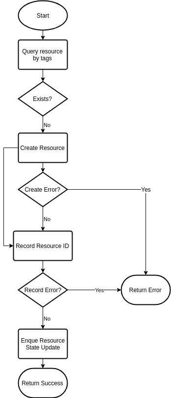
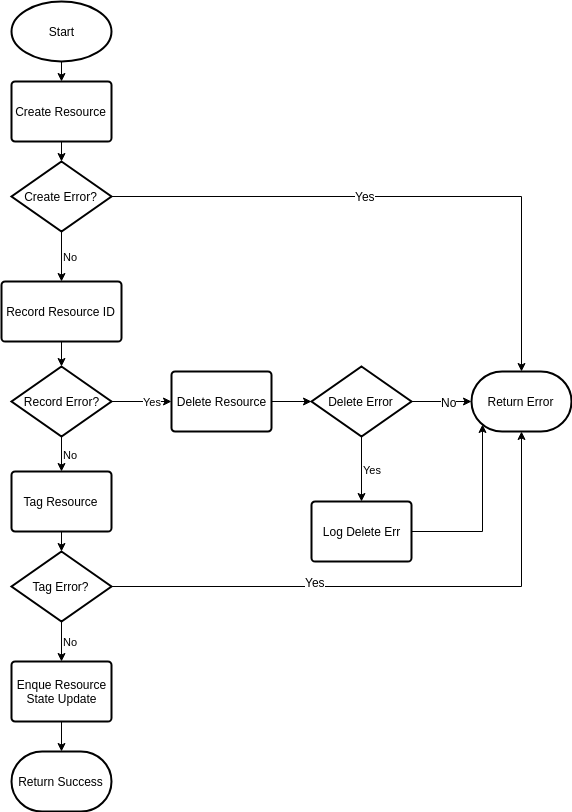

# AWS Resource Handling

## Problem

Since the AWS APIs do not provide consistent support for tagging resources on creation or idempotent operations, we need to ensure that we can provide as much of an external guarantee to users as we can. Otherwise we risk creating and orphaning resources on users leading to extraneous costs and the potential to exhaust resource quotas prematurely.

## Existing solutions and drawbacks for our use

### kops

kops relies heavily on tagging of resources. This provides the benefit of recreating the state of the cluster resources by querying with filters. However, in many cases tagging requires a second API call and there are some resources that are not able to be tagged. If we succeed in creating a resource but fail to tag the resource, then we risk the chance of orphaning that resource for the user.

### Kubicorn

In contrast to the kops approach, Kubicorn mainly relies on recording the resource IDs as part of state. However, since we rely on an external API server for recording the state there is still a possibility of creating the resource and failing to record the resource ID, which still exposes the possible risk of orphaning that resource for the user.

## Summary of edge cases for creating an individual resource

- resource create succeeds, but subsequent tagging fails
- resource creates succeeds, but update of cluster/machine object fails
- attempting to delete resource fails after a successful create it but before recording/tagging it
- the controller/actuator dies after creating a resource but before tagging and or recording the resource

## Proposed workflow

Where possible use [client tokens](https://docs.aws.amazon.com/AWSEC2/latest/APIReference/Run_Instance_Idempotency.html) in the create request so that subsequent requests will return the same response.

### Create resource with tag support

- Query resource by tags to determine if resource already exists
- Create the resource if it doesn't already exist
- Attempt to record the ID to the cluster/machine object
- Enque update for available/ready state if not already available/ready

### Create resource with separate tagging required

- Create resource
- Attempt to record ID to cluster/machine object
  - Attempt rollback of created resource, logging if unsuccessful
- Attempt to tag resource
- Enque update for available/ready state if not already available/ready

