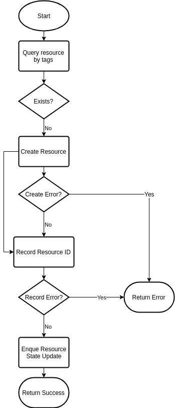
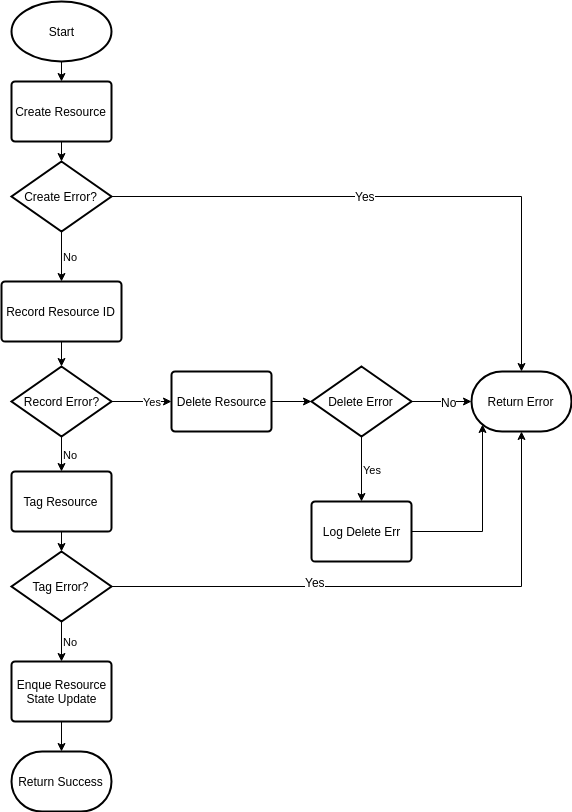

# AWS Resource Handling

## Problem

Since the AWS APIs do not provide consistent support for tagging resources on creation or idempotent operations, we need to ensure that we can provide as much of an external guarantee to users as we can. Otherwise we risk creating and orphaning resources on users leading to extraneous costs and the potential to exhaust resource quotas prematurely.

## Existing solutions and drawbacks for our use

### kops

kops relies heavily on tagging of resources. This provides the benefit of recreating the state of the cluster resources by querying with filters. However, in many cases tagging requires a second API call and there are some resources that are not able to be tagged. If we succeed in creating a resource but fail to tag the resource, then we risk the chance of orphaning that resource for the user.

### Kubicorn

In contrast to the kops approach, Kubicorn mainly relies on recording the resource IDs as part of state. However, since we rely on an external API server for recording the state there is still a possibility of creating the resource and failing to record the resource ID, which still exposes the possible risk of orphaning that resource for the user.

## Summary of edge cases for creating an individual resource

1. resource create succeeds, but subsequent tagging fails
2. resource creates succeeds, but update of cluster/machine object fails
3. attempting to delete resource fails after an attempt to rollback due to a failure to record the ID of the created resource to the cluster/machine object for resources that do not support tagging on create.
4. the controller/actuator dies after creating a resource but before tagging and or recording the resource

## Misc TODOs

- Incorporate retries for AWS or cluster-api requests?
- Enumerate specific classes of workflows and identify which resources fall into which class based on tagging support, client token support, etc.

## Using client tokens

Where possible use [client tokens](https://docs.aws.amazon.com/AWSEC2/latest/APIReference/Run_Instance_Idempotency.html) in the create request so that subsequent requests will return the same response.

## Tagging of resources

Resources that are managed by the controllers/actuators should be tagged with: `kubernetes.io/cluster/<name or id>=owned`

Question: Since other tools/components interact and create resources using the `kubernetes.io/cluster/<name or id>=owned` tag, should we also add a cluster-api-provider-aws specific tag for filtering?

TODO: Define additional tags that can be used to provide additional metadata about the resource configuration/usage by the actuator. This is would allow us to rebuild status without relying on polluting the object config.

## Handling of errors

Each resource has specific error codes that it will return and these can be used to differentiate fatal errors from retryable errors. These errors are well documented in some cases (elbv2 api), and poorly in others (ec2 api). We should provide a best effort to [properly handle these errors](https://docs.aws.amazon.com/sdk-for-go/v1/developer-guide/handling-errors.html) in the correct manner.

## Proposed workflows

### Resource with tag on create support

#### Create resource with tag on create support

- Query resource by tags to determine if resource already exists
- Create the resource if it doesn't already exist
- Update the cluster/machine object config and status
  - If update fails return a retryable error to reque the create
- Enque cluster/machine update if not already available/ready

TODO: update flowchart

#### Update resource with tag on create support

- Query resource by ID
- Update object status
- Enque cluster/machine update if not already available/ready

#### Edge case coverage

1. tagging is handled on creation
2. since resources are tagged on creation, returning an error and requeing the create will find the tagged resource and attempt to retry the object update.
3. there is no delete attempt since we can re-query the resource by tags.
4. the next attempt to create the resource will find the already created resource by tags.

### Resource with separate tagging required - option 1

#### Create resource with separate tagging required - option 1

- Create resource
- Update cluster/machine object config and status
  - If update fails attempt delete of created resource
    - If delete fails log delete failure
- Tag AWS resource
- Enque cluster/machine update if not already available/ready or tagging fails

TODO: update flowchart

#### Update resource with separate tagging required - option 1

- Query resource by ID
- tag resource if missing tags
- Update object status
- Enque cluster/machine update if not already available/ready

#### Edge case coverage

1. Yes - Since the resource ID is already recorded, the update process will reconccile missing tags
2. Yes - If the object update fails, we attempt to rollback the creation
3. No - If we fail to delete the resource, we will still orphan the resource, but output a log message for querying/followup
4. No - If the process dies before recording the ID the resource is orphaned. If the process dies after recording the ID, but before tagging it is reconciled through update.

### Resource with separate tagging required - option 2

### Create resource with separate tagging required - option 2

- Query resource by tags to determine if resource already exists
- Create the resource if it doesn't already exist
- Update cluster/machine object config and status
  - Note failure but do not return error yet
- Tag AWS resource if needed
  - If both update and tagging fails, delete resource
    - If delete fails log failure prominently, return non-retryable error
  - If only tagging fails, return retryable error
- If update failed, return retryable error
- Enque cluster/machine update if not already available/ready or tagging fails

TODO: flowchart

#### Update resource with separate tagging required - option 2

- Query resource by ID
- Update object status
- Enque cluster/machine update if not already available/ready

#### Edge case coverage

1. TODO
2. TODO
3. TODO
4. TODO
