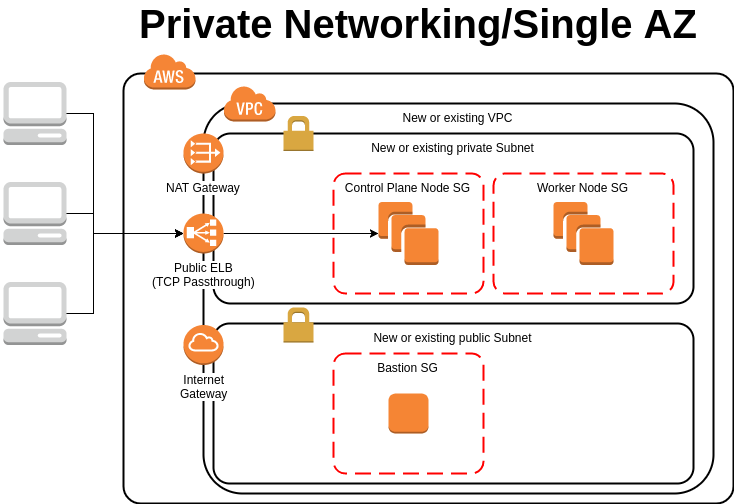
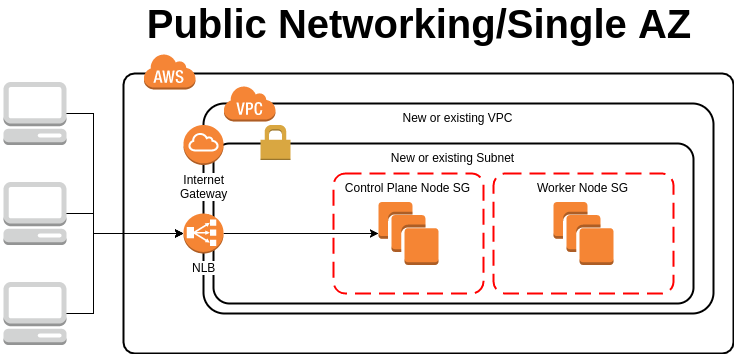

# AWS Provider MVP

This is a proposal for possible MVP candidates for cluster-api-provider-aws. Features referenced are from the [Features Document](features.md).

## Table of Contents

A table of contents is helpful for quickly jumping to sections of a KEP and for highlighting any additional information provided beyond the standard KEP template.
[Tools for generating][] a table of contents from markdown are available.

- [AWS Provider MVP](#aws-provider-mvp)
    - [Table of Contents](#table-of-contents)
    - [Summary](#summary)
    - [Motivation](#motivation)
        - [Goals](#goals)
        - [Non-Goals](#non-goals)
    - [Proposal](#proposal)
        - [Implementation Details/Notes/Constraints](#implementation-detailsnotesconstraints)
            - [Features Implemented for Private Networking, Single AZ](#features-implemented-for-private-networking-single-az)
            - [Filling in Gaps from Feature List](#filling-in-gaps-from-feature-list)
    - [Alternatives](#alternatives)
        - [Public Networking, Single AZ](#public-networking-single-az)
            - [Features Implemented for Public Networking, Single AZ](#features-implemented-for-public-networking-single-az)

## Summary

In order to limit scope of the project and to be able to deliver an MVP implementation of the AWS Provider for the Cluster API, this proposal presents an infrastructure architecture to target for the initial release of the AWS Provider.

## Motivation

### Goals

- An MVP implementation for cluster-api-provider-aws
- kubeadm-driven installation

### Non-Goals

- Cluster-api potential impedance mismatches:
  - EKS-based deployments (25)
  - Auto Scaling Groups (20)
- Separate control of public/private network selection between control plane and workers.
- Multi-AZ-based deployments (9, 14)
- Instance Creation
  - placement groups (15)
  - Dedicated Tenancy (17)
  - Spot Instances
- Accessibility
  - Private API Server Access (23)
  - VPC PrivateLink (31)
- Default to pre-baked images and leveraging kubeadm for deployment
  - Custom CRI configuration (33, 34)
  - Custom kubelet configuration (39)
  - [Red Hat] Arbitrary bootstrap script support (40)
  - Custom API Server configuration (41, 42)
- Deploying etcd to dedicated hosts (47, 48)

## Proposal

### Implementation Details/Notes/Constraints

Private Networking, Single AZ

#### Features Implemented for Private Networking, Single AZ

- VPC: 1, 2, 3
- Control Plane Placement: 5, 7, 8
- Worker Node Placement: 10, 12, 13, 16
- Worker Node Scaling: 18, 19
- API Server Access: 21, 22, 43
- Type of Control Plane: 24, 26
- CRI: None
- Container Hosts: 36, 37, 38
- API Server Configuration: None
- etcd location: 45, 46

#### Filling in Gaps from Feature List

- Require predefined IAM Roles/Instance Profiles
- Security Groups created on demand or use predefined
- Bootstrapping
  - Pre-baked images containing binaries required as input
  - Cloud-init driven using kubeadm
  - Kubeadm config used to provide customization

## Alternatives

### Public Networking, Single AZ

#### Features Implemented for Public Networking, Single AZ

- VPC: 1, 2, 3
- Control Plane Placement: 5, 6, 8
- Worker Node Placement: 10, 11, 13, 16
- Worker Node Scaling: 18, 19
- API Server Access: 21, 22, 43
- Type of Control Plane: 24, 26
- CRI: None
- Container Hosts: 36, 37, 38
- API Server Configuration: None
- etcd location: 45, 46