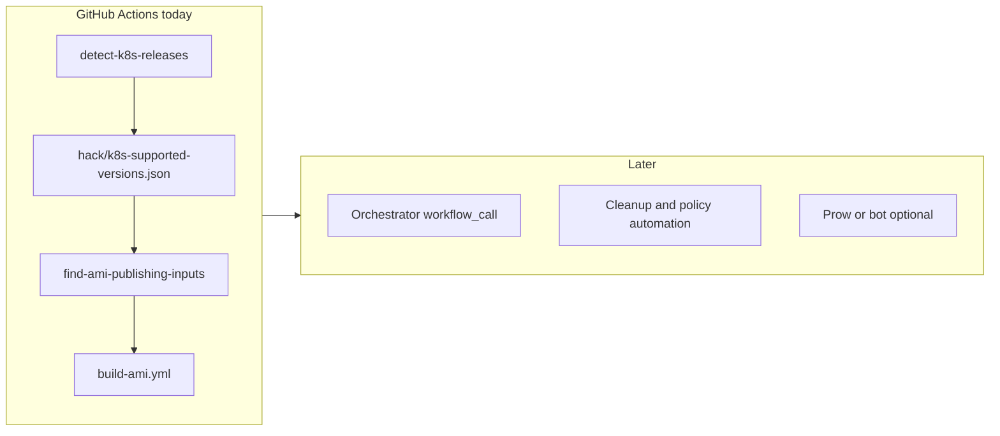

# CAPA AMI publication and maintenance — technical roadmap

This document consolidates ideas from [proposal1.md](./proposal1.md) (Kubernetes-org scale: Prow, bots, staging/conformance) and [proposal2.md](./proposal2.md) (GitHub Actions, inventory, orchestration in-repo). It describes the **current repository state**, a **two-month minimum-viable** track, and a **long-term** direction aligned with cluster-api-provider-aws today.

**Audience:** maintainers and contributors who build or consume reference AMIs.

**Related issues:** [kubernetes-sigs/cluster-api-provider-aws#1861](https://github.com/kubernetes-sigs/cluster-api-provider-aws/issues/1861), [kubernetes-sigs/cluster-api-provider-aws#1982](https://github.com/kubernetes-sigs/cluster-api-provider-aws/issues/1982), [kubernetes-sigs/cluster-api-provider-aws#5142](https://github.com/kubernetes-sigs/cluster-api-provider-aws/issues/5142).

---

## 1. Executive summary

Reference AMIs for CAPA are built and published from this repository using **GitHub Actions**, targeting a **CNCF-owned AWS account** (`819546954734`) with **OIDC**-backed IAM. The process is still **manual in the critical path** (workflow dispatch and eight version-related inputs per run). A scheduled workflow updates **supported Kubernetes series and patches** in-repo; **AMI lifecycle policy** (deletion when a series leaves the support window) is documented but not fully automated.

**Near-term strategy (about two months):** improve **signal** (supported versions file), **operator ergonomics** (machine-readable publishing inputs), **policy clarity** (what is manual vs automated), and **test coverage** (re-enable high-value E2E behind real AMIs). **Avoid** Prow and full publish orchestration until those foundations are stable.

**Long-term strategy:** optional orchestrator workflows, inventory of published AMI IDs in Git, gated cleanup, post-build validation, and—if the project chooses—alignment with Kubernetes `test-infra` / trusted Prow patterns from proposal 1.

---

## 2. How proposal 1 and proposal 2 map to this roadmap

| Theme | Proposal 1 | Proposal 2 | This roadmap |
|-------|------------|--------------|--------------|
| Triggers | File or bot (`amis.yaml`), Prow pre/post-submit | Scheduled + manual GHA; inventory JSON | **Short term:** keep GHA + `detect-k8s-releases`; **long term:** optional bot/orchestrator |
| Secrets | k8s-infra trusted Prow, restricted access | Implicit: GHA OIDC to publish role | **Document** current OIDC; **long term** revisit if moving to Prow |
| Build vs publish | Staging then “promotion” | Single job build+publish | **Short term:** unchanged; **long term** optional staging + tests |
| Inputs | Maintainer-edited manifest | `find-ami-publishing-inputs.sh`, 8 workflow inputs | **Short term:** JSON/env output from script; **long term** `workflow_call` |
| Lifecycle | Deletion policy, cleanup jobs | `ami-cleanup` workflow, `clusterawsadm` subcommands | **Short term** document manual steps; **long term** automate with approval gates |
| Tests | Conformance / smoke before wide publish | Re-enable PDescribe E2E | **Short term** phased E2E enablement |

---

## 3. Current state (repository baseline)

### 3.1 Build and publish

- **Workflow:** [.github/workflows/build-ami.yml](../.github/workflows/build-ami.yml).
- **Trigger:** `workflow_dispatch` only.
- **Inputs:** `image_builder_version`, `regions`, `k8s_semver`, `k8s_series`, `k8s_rpm_version`, `k8s_deb_version`, `cni_semver`, `cni_deb_version`, `crictl_version`.
- **Targets (matrix):** `ubuntu-2204`, `ubuntu-2404`, `flatcar` (`max-parallel: 1`).
- **Implementation:** Checks out [`kubernetes-sigs/image-builder`](https://github.com/kubernetes-sigs/image-builder) at the pinned ref; runs Packer via `make build-ami-<target>` with `vars.json`.
- **AWS auth:** [`aws-actions/configure-aws-credentials`](../.github/workflows/build-ami.yml) with `role-to-assume: arn:aws:iam::819546954734:role/gh-image-builder`.

Variant with ad-hoc Packer vars: [.github/workflows/build-ami-varsfile.yml](../.github/workflows/build-ami-varsfile.yml).

### 3.2 Kubernetes version signal

- **Workflow:** [.github/workflows/detect-k8s-releases.yml](../.github/workflows/detect-k8s-releases.yml).
- **Schedule:** Cron on the **15th** of each month (aligned with patch release cadence documentation); `workflow_dispatch` for manual runs.
- **Output PR:** Updates [hack/k8s-supported-versions.json](./k8s-supported-versions.json) via [scripts/update-k8s-supported-versions.sh](../scripts/update-k8s-supported-versions.sh).
- **Script:** [scripts/find-ami-publishing-inputs.sh](../scripts/find-ami-publishing-inputs.sh) derives rpm/deb/CNI/crictl lines from a series or patch (container-based); today oriented to **human-readable** output.

### 3.3 Publication policy (docs)

Canonical text: [docs/book/src/topics/images/built-amis.md](../docs/book/src/topics/images/built-amis.md).

- AMIs for **non-production** reference use.
- Publish for **latest minor series** and **two previous** series.
- When a **new minor series** is released, AMIs for the series that **falls out** of that window **should be removed**.
- Patches: users should move to the **latest patch**; images are not continuously patched in place.
- Supported OS in docs: Ubuntu 22.04 / 24.04, Flatcar; CentOS 7 and Amazon Linux 2 called out as **blocked** pending [issue #5142](https://github.com/kubernetes-sigs/cluster-api-provider-aws/issues/5142).

### 3.4 E2E and AMI dependencies

- [test/e2e/suites/unmanaged/unmanaged_CAPI_clusterclass_test.go](../test/e2e/suites/unmanaged/unmanaged_CAPI_clusterclass_test.go): **Self Hosted** and **Cluster Upgrade (HA)** specs use `ginkgo.PDescribe` (disabled by default).
- [test/e2e/suites/unmanaged/unmanaged_CAPI_test.go](../test/e2e/suites/unmanaged/unmanaged_CAPI_test.go): **Clusterctl upgrade** spec is `PDescribe`.
- [test/e2e/data/e2e_conf.yaml](../test/e2e/data/e2e_conf.yaml): e.g. `INIT_WITH_KUBERNETES_VERSION: "v1.31.0"` for clusterctl upgrade scenarios.

### 3.5 Target architecture (near-term data flow)

---

## 4. Short-term plan (approximately two months)

Objectives: **fewer manual mistakes**, **clear policy vs practice**, **tests that reflect published AMIs**, **small, reversible automation**—without committing to Prow or unattended full-matrix builds.

### 4.1 Month 1 — Signal, inputs, and policy documentation

**4.1.1 Single source of truth for supported series**

- Treat [hack/k8s-supported-versions.json](./k8s-supported-versions.json) as the **machine-readable** companion to [built-amis.md](../docs/book/src/topics/images/built-amis.md) (latest + two previous series).
- Prefer a **stable schema** for forward compatibility—for example per-series objects with `latest_patch`, `support_status`, and an **`amis` array** (initially empty) so future automation can append IDs without another breaking change.
- Keep [.github/workflows/detect-k8s-releases.yml](../.github/workflows/detect-k8s-releases.yml) as the scheduled updater; optionally add a short **maintainer runbook** under `docs/` or `hack/` describing: merge detection PR → run `find-ami-publishing-inputs` per `latest_patch` → trigger [build-ami.yml](../.github/workflows/build-ami.yml) per OS matrix.

**4.1.2 Reduce publishing input friction**

- Extend [scripts/find-ami-publishing-inputs.sh](../scripts/find-ami-publishing-inputs.sh) with **`--format json`** (and optionally **`--format github-env`** for `workflow_dispatch` fields) so all eight version-related inputs can be copied in one step.

**4.1.3 Policy and guardrails (without full deletion automation)**

- Extend [built-amis.md](../docs/book/src/topics/images/built-amis.md) or add **`docs/book/src/topics/images/ami-lifecycle.md`** to record:
  - **Deletion** is currently **manual** (recommended tooling: `clusterawsadm ami list`, AWS console or CLI).
  - **Supported window** matches `supported_series` / detection rules in `hack/k8s-supported-versions.json`.
- Optional: a **lint script** in CI that validates `hack/k8s-supported-versions.json` (e.g. exactly three series, ordering, schema)—**no AWS API calls**.

### 4.2 Month 2 — Tests and thin automation

**4.2.1 E2E improvements**

- For each disabled `PDescribe`, document **required Kubernetes versions**, **flavors**, and **regions**; compare with **`clusterawsadm ami list --kubernetes-version …`** against account `819546954734`.
- **Enable one spec first** with the smallest AMI and version footprint; expand to **Cluster Upgrade** and **Self Hosted** once AMIs and quotas are proven.
- **Clusterctl upgrade** paths depend on **fixed older provider versions** and **v1.31.0** (per `e2e_conf.yaml`); either **publish** those AMIs or **adjust** test inputs to versions that are actually published—avoid flipping `PDescribe` → `Describe` without an inventory check.

**4.2.2 Optional orchestration**

- Add **`workflow_call`** to [build-ami.yml](../.github/workflows/build-ami.yml) with the same inputs as `workflow_dispatch`.
- Add a **caller workflow** that is **only** `workflow_dispatch`, looping `supported_series` × OS targets—**opt-in** for cost control until unattended runs are policy-approved.

**4.2.3 Operations and security**

- Document in the same technical or contributor doc: **who may run** AMI workflows, **`gh-image-builder`** role, **OIDC** trust (no long-lived keys in the repo)—bridging proposal 1’s secret concerns with **current** GitHub Actions practice.

---

## 5. Long-term plan (beyond two months)

1. **Orchestrator and inventory:** After successful builds, record AMI IDs in **`amis`** (or a dedicated inventory file) and open or update PRs automatically; use [build-ami-varsfile.yml](../.github/workflows/build-ami-varsfile.yml) when non-default Packer inputs are required.

2. **Lifecycle automation:** Scheduled **`ami-cleanup`** (default **dry-run**), human approval via GitHub **Environment**; implement reusable logic in **`clusterawsadm`** (see proposal 2 sketch) so CLI and CI share rules.

3. **Quality gates:** Post-build **smoke or conformance** on the CNCF account; optional **staging** AMIs vs **published** AMIs (proposal 1) once cost and ownership are agreed.

4. **Kubernetes infra alignment:** If builds move to **Prow** (`k8s-infra-prow-build-trusted`), keep the **same JSON policy contracts** so only the executor and secret store change.

5. **OS matrix:** Unblock **Amazon Linux 2** and **CentOS 7** per [#5142](https://github.com/kubernetes-sigs/cluster-api-provider-aws/issues/5142); add **Rocky/RHEL** only after Ubuntu and Flatcar pipelines are reliable.

---

## 6. Revision history

| Date | Author | Summary |
|------|--------|---------|
| 2026-04 | CAPA contributors | Initial combined roadmap from hack/proposal1.md and hack/proposal2.md |

---

## 7. References

- [development/amis.md](../docs/book/src/development/amis.md) — developer-facing AMI publishing notes (if present in tree).
- [topics/images/built-amis.md](../docs/book/src/topics/images/built-amis.md) — user-facing policy and regions.
- [Kubernetes patch releases](https://kubernetes.io/releases/patch-releases/) — cadence context for scheduled detection.
