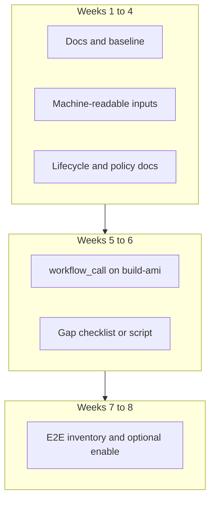

# Improve CAPA AMI publication and maintenance

| Field | Details |
| ----- | ------- |
| **Status** | Draft (for maintainer feedback; may move to project docs later) |
| **Audience** | CAPA maintainers, release contributors, mentorship / junior developers |
| **Related** | [Epic #5836](https://github.com/kubernetes-sigs/cluster-api-provider-aws/issues/5836), [Issue #1982](https://github.com/kubernetes-sigs/cluster-api-provider-aws/issues/1982) |

**See also:** [ami-publication-roadmap.md](./ami-publication-roadmap.md) for a complementary technical roadmap.

---

## Table of contents

1. [Executive summary](#executive-summary)
2. [Terminology](#terminology)
3. [Current state in this repository](#current-state-in-this-repository)
4. [Problem statement](#problem-statement)
5. [Goals and non-goals](#goals-and-non-goals)
6. [Existing automation (reference links)](#existing-automation-reference-links)
7. [Two-month implementation plan (junior-friendly)](#two-month-implementation-plan-junior-friendly)
8. [Future work](#future-work)
9. [References](#references)

---

## Executive summary

Cluster API Provider AWS (CAPA) publishes **reference Amazon Machine Images (AMIs)** built with [kubernetes-sigs/image-builder](https://github.com/kubernetes-sigs/image-builder). Those images help users try CAPA quickly but are **not** a substitute for production-hardened images.

Today, publishing is **mostly manual**: maintainers trigger a GitHub Actions workflow and supply many inputs. Supported Kubernetes **series** can be refreshed on a schedule via a detector script, but **AMI builds**, **inventory of published IDs**, **policy-driven cleanup**, and some **E2E tests** are not fully aligned.

This document summarizes gaps, aligns facts with the current tree, and proposes an **eight-week** track suitable for a **junior developer** (with mentor review), focused on documentation clarity, machine-readable build inputs, reusable workflows, and phased test enablement—**without** Prow or unattended mass deletion in the first iteration.

**Constraints:** Workflows that publish to the CNCF AMI account require maintainer access. Development may use a sandbox account; production behavior is validated by maintainers.

---

## Terminology

- **AMI** — AWS machine image used as the node image for EC2 instances.
- **Reference / CAPA AMIs** — Images published by the project for **non-production** evaluation; see [Published AMIs](../docs/book/src/topics/images/built-amis.md).
- **Image-builder** — Upstream repo where Packer builds run; CAPA’s workflow checks out this project and runs `make build-ami-*`.
- **CNCF AMI account** — AWS account **819546954734** (see built-amis docs for `clusterawsadm ami list --owner-id`).
- **Latest + two series** — Publication policy: keep images for the **current** Kubernetes minor release series and the **two previous** series; older series should leave the support window when a new minor ships.

---

## Current state in this repository

**Build and publish**

- Workflow: [.github/workflows/build-ami.yml](../.github/workflows/build-ami.yml) (`build-and-publish-ami`).
- **Trigger:** `workflow_dispatch` only (manual).
- **Inputs (nine total):** `image_builder_version`, `regions`, `k8s_semver`, `k8s_series`, `k8s_rpm_version`, `k8s_deb_version`, `cni_semver`, `cni_deb_version`, `crictl_version`.
- **OS matrix in CI:** `ubuntu-2204`, `ubuntu-2404`, `flatcar`.
- **AWS auth:** OIDC role `gh-image-builder` in account `819546954734`; the Action sets `aws-region: us-east-2` for the credentials step (session region, not necessarily the Packer primary build region).

**Region replication**

- CAPA passes **`ami_regions`** (comma-separated list) into image-builder via `vars.json`. **Which region Packer builds in first** and how copies are made is defined **inside image-builder’s** Packer templates, not in the CAPA repo.

**Version signal**

- [.github/workflows/detect-k8s-releases.yml](../.github/workflows/detect-k8s-releases.yml) runs on a **monthly schedule** (15th UTC, per workflow comment / patch calendar) and via `workflow_dispatch`.
- It runs [scripts/update-k8s-supported-versions.sh](../scripts/update-k8s-supported-versions.sh) and opens a PR updating [hack/k8s-supported-versions.json](./k8s-supported-versions.json).

**Helper for workflow inputs**

- [scripts/find-ami-publishing-inputs.sh](../scripts/find-ami-publishing-inputs.sh) resolves deb/rpm/CNI/crictl values for a series or patch (human-readable output today). Documented under [Publish AMIs (development)](../docs/book/src/development/amis.md).

**Policy**

- [docs/book/src/topics/images/built-amis.md](../docs/book/src/topics/images/built-amis.md) — supported window, non-production disclaimer, regions list, known OS limitations.

---

## Problem statement

### 1. Manual publish path and many workflow inputs

Maintainers must run the build workflow and copy **nine** fields (including image-builder git ref and region list). A helper script exists, but values are still pasted by hand, which is slow and error-prone. There is no fully unattended “new patch detected → build all OS” pipeline in this iteration.

### 2. Operating system coverage vs aspiration

Docs and `clusterawsadm` may mention additional OS targets; **CI today** builds only Ubuntu 22.04, Ubuntu 24.04, and Flatcar. Amazon Linux 2 and CentOS 7 builds are blocked for known reasons ([issue #5142](https://github.com/kubernetes-sigs/cluster-api-provider-aws/issues/5142)). Rocky / RHEL are not in the build matrix.

### 3. E2E tests disabled or blocked by AMI availability

Several high-value specs use `ginkgo.PDescribe` (skipped by default), including in:

- [test/e2e/suites/unmanaged/unmanaged_CAPI_clusterclass_test.go](../test/e2e/suites/unmanaged/unmanaged_CAPI_clusterclass_test.go) (e.g. self-hosted, cluster upgrade),
- [test/e2e/suites/unmanaged/unmanaged_CAPI_test.go](../test/e2e/suites/unmanaged/unmanaged_CAPI_test.go) (e.g. clusterctl upgrade; versions such as `INIT_WITH_KUBERNETES_VERSION` in [test/e2e/data/e2e_conf.yaml](../test/e2e/data/e2e_conf.yaml)).

Re-enabling requires **matching published AMIs** to those versions—never flip `PDescribe` to `Describe` without that check.

### 4. Publication policy vs cleanup automation

Policy says older-series AMIs should be removed when they fall outside **latest + two** series. **Automation for listing, approving, and deleting** those AMIs is not fully implemented here; maintainers may still see older images when running `clusterawsadm ami list` for the community owner ID.

To audit AMIs, use the documented owner and CLI (see [built-amis.md](../docs/book/src/topics/images/built-amis.md)); do not rely on a static external “full AMI list” link in this doc.

### 5. Multi-region publish time and operations

Publishing to **many regions** increases wall-clock time and operational cost. That is expected when using image-builder’s replication behavior; improving automation and checklists reduces human load even if total build time stays high.

---

## Goals and non-goals

**Goals (first ~8 weeks)**

- Clear documentation of **as-is** vs **to-be** processes and policy.
- **Machine-readable** build metadata (e.g. JSON from `find-ami-publishing-inputs`) and optional **callable** `build-ami` workflow for maintainers.
- **Gap visibility** (checklist / script) between `k8s-supported-versions.json` and what maintainers expect to publish.
- **E2E inventory** and **at most one** spec enabled with mentor agreement where AMIs exist.

**Non-goals**

- No **Prow** or Kubernetes trusted-cluster-only requirement in this phase.
- No **unattended** mass **deregister** of AMIs without approval gates and tooling review.
- No promise to **restore all seven OS** targets in eight weeks (track as future work).

---

## Existing automation (reference links)

Instead of pasting duplicate YAML (which goes stale), use the live files:

| Concern | Location |
| ------- | -------- |
| Detect upstream branches / releases → JSON | [.github/workflows/detect-k8s-releases.yml](../.github/workflows/detect-k8s-releases.yml), [scripts/update-k8s-supported-versions.sh](../scripts/update-k8s-supported-versions.sh) |
| Build AMIs | [.github/workflows/build-ami.yml](../.github/workflows/build-ami.yml) |
| Vars-file variant | [.github/workflows/build-ami-varsfile.yml](../.github/workflows/build-ami-varsfile.yml) |
| Supported versions file | [hack/k8s-supported-versions.json](./k8s-supported-versions.json) |

---

## Two-month implementation plan (junior-friendly)

Assumptions: about **15–20 hours/week**; **mentor** runs CNCF-account workflows; one **primary deliverable** per week.

| Week | Theme | Tasks | Definition of done | Mentor checkpoint |
| ---- | ----- | ----- | -------------------- | ----------------- |
| **1** | Onboarding | Read [built-amis.md](../docs/book/src/topics/images/built-amis.md) and [development/amis.md](../docs/book/src/development/amis.md). Trace `detect-k8s-releases` → `update-k8s-supported-versions.sh` → `k8s-supported-versions.json`. List all `build-ami.yml` inputs and matrix targets. | One-page “as-is” summary (can live in this file or a linked hack note) | Accuracy review |
| **2** | Writing | Ensure this proposal has no contradictions (schedule, script names, input counts). Link to real files instead of stale YAML dumps. | Readers can skim TOC and current-state section without confusion | Doc pass |
| **3** | Build inputs | Add **`--format json`** (and optionally `--format github-env`) to `find-ami-publishing-inputs.sh`; document in [development/amis.md](../docs/book/src/development/amis.md). | Works for `vX.Y` and `vX.Y.Z`; example in dev doc | Shell + doc review |
| **4** | Policy / lifecycle | Add or extend **AMI lifecycle** documentation (new `ami-lifecycle.md` or a section in built-amis): manual vs automated today; how to list AMIs (`clusterawsadm ami list`, owner **819546954734**); align with `hack/k8s-supported-versions.json` as signal source. | Doc PR ready; no requirement to automate deletion | Policy review |
| **5** | Callable workflow | Add `workflow_call` to [build-ami.yml](../.github/workflows/build-ami.yml) mirroring `workflow_dispatch` inputs; document testing via `gh workflow run`. | Callable interface reviewed; optional maintainer test run | Workflow review |
| **6** | Gap visibility | Small script or documented target: from `k8s-supported-versions.json`, emit a **maintainer checklist** (expected patches × OS rows); compare manually to `ami list` until automation exists. | Checklist usable after each detect PR | Maintainer try-out |
| **7** | E2E inventory | Table: each `PDescribe` spec → required K8s versions → AMIs needed (from [e2e_conf.yaml](../test/e2e/data/e2e_conf.yaml) and test sources under [test/e2e/suites/unmanaged/](../test/e2e/suites/unmanaged/)). | Table in issue or doc; no blind enable | Test owner review |
| **8** | Handoff | With mentor: enable **at most one** spec if AMIs exist, or file follow-ups. Refresh **Future work** in this doc to match what shipped. Clear next issues | Proposal reflects done vs deferred | Sign-off |

---

## Future work

Defer past week 8 (examples):

- **AMI cleanup workflow** with default **dry-run** and GitHub **Environment** approval; shared logic in Go (`clusterawsadm ami cleanup`) or a well-reviewed script.
- **`ami-publish-orchestrator`** workflow: unattended multi-OS builds only after policy, cost, and rollback story are agreed.
- **Single inventory**: extend [hack/k8s-supported-versions.json](./k8s-supported-versions.json) (or one successor file) with **published AMI IDs**—avoid a second `ami-version.json` without migrating consumers.
- **OS expansion**: unblock Amazon Linux 2 / CentOS 7 ([#5142](https://github.com/kubernetes-sigs/cluster-api-provider-aws/issues/5142)); Rocky / RHEL after Ubuntu/Flatcar path is stable.
- **Post-build validation** (smoke or conformance) on the CNCF account.
- **Prow / k8s-infra** execution model if the project standardizes on it—keep the same **contracts** (JSON + policy) so only the executor changes.

---

## References

- [Kubernetes patch releases](https://kubernetes.io/releases/patch-releases/)
- [CAPA: Published AMIs (policy)](https://cluster-api-aws.sigs.k8s.io/topics/images/built-amis.html)
- [CAPA: Publish AMIs (development)](https://cluster-api-aws.sigs.k8s.io/development/amis.html)
- Image-builder Packer behavior (primary region / `ami_regions`): **kubernetes-sigs/image-builder** repository (`images/capi`).
