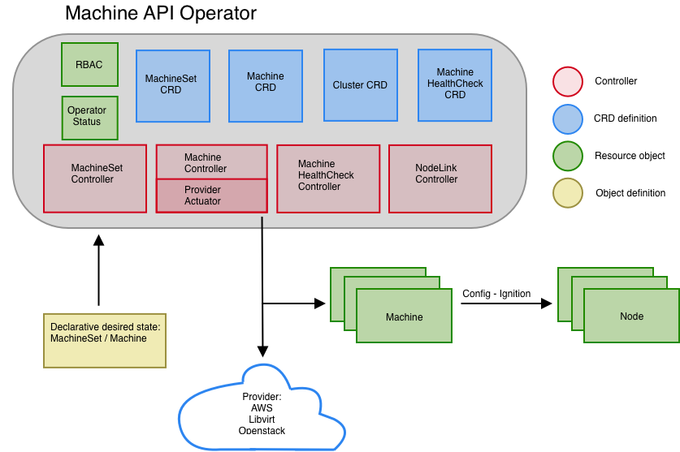

# Machine API Operator

The Machine API Operator manages the lifecycle of specific purpose CRDs, controllers and RBAC objects that extend the Kubernetes API.
This allows to convey desired state of machines in a cluster in a declarative fashion.

## Architecture



## CRDs

- MachineSet
- Machine
- Cluster
- MachineHealthCheck

## Controllers

### Cluster API controllers
- [MachineSet Controller](https://github.com/kubernetes-sigs/cluster-api/tree/master/pkg/controller)
  - Reconciles desired state for [MachineSets](https://github.com/kubernetes-sigs/cluster-api/blob/master/pkg/apis/cluster/v1alpha1/machineset_types.go) by ensuring presence of specified number of replicas and config for a set of machines.

- [Machine Controller](https://github.com/kubernetes-sigs/cluster-api/tree/master/pkg/controller)
  - Reconciles desired state for [Machines](https://github.com/kubernetes-sigs/cluster-api/blob/master/pkg/apis/cluster/v1alpha1/machine_types.go) by ensuring that instances with a desired config exist in a given cloud provider. Currently we support:

  - [cluster-api-provider-aws](https://github.com/openshift/cluster-api-provider-aws)

  - [cluster-api-provider-libvirt](https://github.com/openshift/cluster-api-provider-libvirt)

  - [cluster-api-provider-openstack](https://github.com/kubernetes-sigs/cluster-api-provider-openstack). Coming soon.

- [Node Controller](https://github.com/kubernetes-sigs/cluster-api/tree/master/pkg/controller)
  - Reconciles desired state of machines by matching IP addresses of machine objects with IP addresses of node objects. Annotating node with a special label containing machine name that the cluster-api node controller interprets and sets corresponding nodeRef field of each relevant machine.

### Nodelink controller

- Reconciles desired state of machines by matching IP addresses of machine objects with IP addresses of node objects and annotates nodes with a special [machine annotation](https://github.com/kubernetes-sigs/cluster-api/blob/master/pkg/controller/node/node.go#L35) containing the machine name. The cluster-api node controller interprets the annotation and sets the corresponding nodeRef field of each relevant machine.

- Build:

```
$ make nodelink-controller
```

### Machine healthcheck controller

- Reconciles desired state for [MachineHealthChecks](https://github.com/openshift/machine-api-operator/blob/master/pkg/apis/healthchecking/v1alpha1/machinehealthcheck_types.go) by ensuring that machines targeted by machineHealthCheck objects are healthy or remediated otherwise.

- Build:

  ```
  $ make machine-healthcheck
  ```

- How to test it:

  1. Create a machineset and locate its selector. Assuming the selector corresponds
     to the following list of match labels:
     ```
     machine.openshift.io/cluster-api-cluster: cluster
     machine.openshift.io/cluster-api-machine-role: worker
     machine.openshift.io/cluster-api-machine-type: worker
     machine.openshift.io/cluster-api-machineset: cluster-worker-us-east-1a
     ```

  1. Define a `MachineHealthCheck` manifest that will be watching all machines
     of the machinset based on its match labels:
     ```yaml
     apiVersion: healthchecking.openshift.io/v1alpha1
     kind: MachineHealthCheck
     metadata:
       name: example
       namespace: default
     spec:
       selector:
         matchLabels:
           machine.openshift.io/cluster-api-cluster: cluster
           machine.openshift.io/cluster-api-machine-role: worker
           machine.openshift.io/cluster-api-machine-type: worker
           machine.openshift.io/cluster-api-machineset: cluster-worker-us-east-1a
     ```

  1. By default, the machine health check controller recognize only `NotReady` condition and will remove
     unhealthy machine after 5 minutes. If you want to customize unhealthy conditions you can create `node-unhealthy-conditions` config map, for example:
     ```yaml
     apiVersion: v1
     kind: ConfigMap
     metadata:
       name: node-unhealthy-conditions
       namespace: openshift-machine-api
     data:
       conditions: |
         items:
         - name: NetworkUnavailable 
           timeout: 5m
           status: True
     ```
  
  1. Pick a node that is managed by one of the machineset's machines
  1. SSH into the node, disable and stop the kubelet services:
     ```
     # systemctl disable kubelet
     # systemctl stop kubelet
     ```

  1. After some time the node will transition into `NotReady` state
  1. Watch the `machine-healthcheck` controller logs to see how it notices a node
     in `NotReady` state and starts to reconcile the node
  1. After some time the current node instance is terminated and
     new instance is created. Followed by new node joining the cluster
     and turning in `Ready` state.

## Dev

- Build:

  ```sh
  $ make build
  ```

- Run:

  ```sh
  $ ./bin/machine-api-operator start --kubeconfig ${HOME}/.kube/config --images-json=pkg/operator/fixtures/images.json
  ```

- Image:

  ```
  $ make image
  ```

The Machine API Operator is designed to work in conjunction with the [Cluster Version Operator](https://github.com/openshift/cluster-version-operator).
You can see it in action by running an [OpenShift Cluster deployed by the Installer](https://github.com/openshift/installer).

However you can run it in a vanilla Kubernetes cluster by precreating some assets:

- Create a `openshift-machine-api-operator` namespace
- Create a [CRD Status definition](test/integration/manifests/status-crd.yaml)
- Create a [CRD Machine definition](install/0000_30_machine-api-operator_02_machine.crd.yaml)
- Create a [CRD MachineSet definition](install/0000_30_machine-api-operator_03_machineset.crd.yaml)
- Create a [CRD MachineDeployment definition](install/0000_30_machine-api-operator_04_machinedeployment.crd.yaml)
- Create a [CRD Cluster definition](install/0000_30_machine-api-operator_05_cluster.crd.yaml)
- Create a [Installer config](test/integration/manifests/install-config.yaml)
- Then you can run it as a [deployment](install/0000_30_machine-api-operator_09_deployment.yaml)
- You should then be able to deploy a [cluster](test/integration/manifests/cluster.yaml) and a [machineSet](test/integration/manifests/machineset.yaml) object

## Machine API operator with Kubemark over Kubernetes

INFO: For development and testing purposes only

1. Deploy MAO over Kubernetes:
  ```sh
   $ kustomize build | kubectl apply -f -
   ```

2. Deploy [Kubemark actuator](https://github.com/openshift/cluster-api-provider-kubemark) prerequisities:
   ```sh
   $ kustomize build config | kubectl apply -f -
   ```

3. Create `cluster-config-v1` configmap to tell the MAO to deploy `kubemark` provider:
   ```yaml
   apiVersion: v1
   kind: ConfigMap
   metadata:
     name: cluster-config-v1
     namespace: kube-system
   data:
     install-config: |-
       platform:
         kubemark: {}
   ```

   The file is already present under `config/kubemark-install-config.yaml` so it's sufficient to run:
   ```sh
   $ kubectl apply -f config/kubemark-install-config.yaml
   ```

## CI & tests

Run unit test:

```
$ make test
```

Run e2e-aws-operator tests. This tests assume that a cluster deployed by the Installer is up and running and a ```KUBECONFIG``` environment variable is set:

```
$ make test-e2e
```

Tests are located under [machine-api-operator repository][1] and executed in prow CI system. A link to failing tests is published as a comment in PR by `@openshift-ci-robot`. Current test status for all OpenShift components can be found in https://deck-ci.svc.ci.openshift.org.

CI configuration is stored under [openshift/release][2] repository and is split into 4 files:
  - [cluster/ci/config/prow/plugins.yaml][3] - says which prow plugins are available and where job config is stored
  - [ci-operator/config/openshift/machine-api-operator/master.yaml][4] - configuration for machine-api-operator component repository
  - [ci-operator/jobs/openshift/machine-api-operator/openshift-machine-api-operator-master-presubmits.yaml][5] - prow jobs configuration for presubmits
  - [ci-operator/jobs/openshift/machine-api-operator/openshift-machine-api-operator-master-postsubmits.yaml][6] - prow jobs configuration for postsubmits

More information about those files can be found in [ci-operator onboarding file][7].

[1]: https://github.com/openshift/machine-api-operator
[2]: https://github.com/openshift/release
[3]: https://github.com/openshift/release/blob/master/cluster/ci/config/prow/plugins.yaml
[4]: https://github.com/openshift/release/blob/master/ci-operator/config/openshift/machine-api-operator/master.yaml
[5]: https://github.com/openshift/release/blob/master/ci-operator/jobs/openshift/machine-api-operator/openshift-machine-api-operator-master-presubmits.yaml
[6]: https://github.com/openshift/release/blob/master/ci-operator/jobs/openshift/machine-api-operator/openshift-machine-api-operator-master-postsubmits.yaml
[7]: https://github.com/openshift/ci-operator/blob/master/ONBOARD.md
