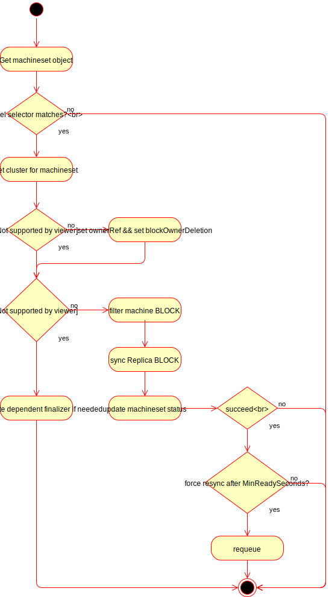

# MachineSet Controller

`MachineSet`s are currently different from `Cluster` and `Machine` resources in
that they do not define an actuator interface. They are generic controllers
which implement their intent by modifying provider-specific `Cluster` and
`Machine` resources.


## MachineSet


[import:'MachineSet'](../../../pkg/apis/deprecated/v1alpha1/machineset_types.go)



## MachineSetSpec


[import:'MachineSetSpec'](../../../pkg/apis/deprecated/v1alpha1/machineset_types.go)



## MachineSetTemplateSpec


[import:'MachineSetTemplateSpec'](../../../pkg/apis/deprecated/v1alpha1/machineset_types.go)



## MachineSetStatus


[import:'MachineSetStatus'](../../../pkg/apis/deprecated/v1alpha1/machineset_types.go)


## MachineSet Controller Semantics

#### filter machine BLOCK

This code block examines all machines in the namespace of the machineset and filters out machines that do NOT
have all the following conditions (in this order):

1. The machine has a controller and is controlled by the machineset.
2. The machine is not scheduled for deletion.
3. The machine's label selector matches that of the machineset.

For machines that fails condition 1, an attempt is made to adopt the machine into the machineset.  The result
of this code block is a filtered list of machines that will be processed in the next code block.

#### sync replica BLOCK

This code block looks at the filtered machine list and determines whether to scale up or down the number of
machines to match the replica count defined in the machineset.
